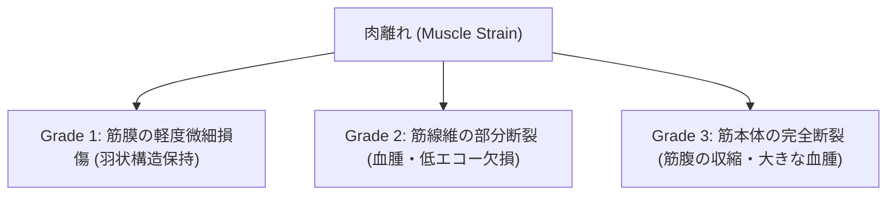

# 股関節疾患の超音波所見

> [!NOTE] 概要
> 変形性股関節症、関節水腫、大腿四頭筋・ハムストリング肉離れ、弾性股（Snapping hip）の所見を解説します。

---

## 1. 股関節水腫・関節炎の評価

- **前方関節包距離（Capsule-to-Bone Distance）**: **> 7mm** または **左右差 > 1mm** で関節水腫と判定。
- **関節包の凸状隆起**: 正常では凹状の関節包が前方へバルーニング（膨隆）。

---

## 2. 筋肉離れのエコーGrade分類

