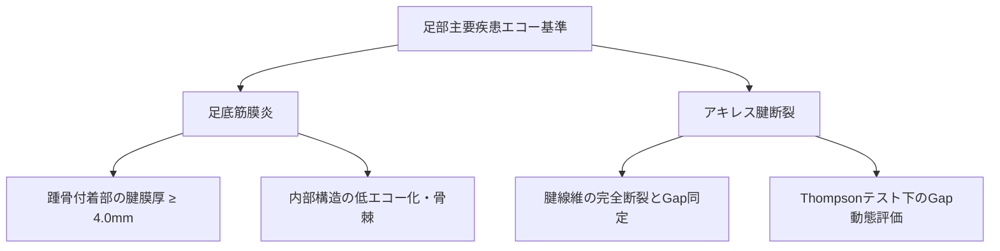

# 足関節・足部疾患の超音波所見

> [!NOTE] 概要
> アキレス腱断裂・腱症、足底筋膜炎、ATFL損傷（足関節捻挫）、Morton病の超音波所見を解説します。

---

## 1. 足底筋膜炎とアキレス腱断裂の診断値

```mermaid
flowchart TD
    A["足部主要疾患エコー基準"] --> B["足底筋膜炎"]
    A --> C["アキレス腱断裂"]

    B --> B1["踵骨付着部の腱膜厚 ≥ 4.0mm"]
    B --> B2["内部構造の低エコー化・骨棘"]

    C --> C1["腱線維の完全断裂とGap同定"]
    C --> C2["Thompsonテスト下のGap動態評価"]
```