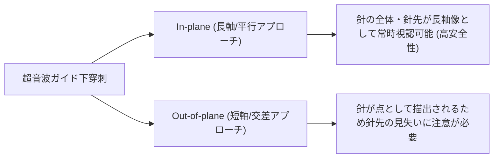

# 超音波ガイド下介入手技 (Interventional US)

> [!IMPORTANT] 安全管理の必須原則
> 針先が常時超音波画面上で確認できる手技（In-plane描出）を選択し、神経内注射（Intraneural Injection）や血管穿刺を絶対 回避します。

---

## 1. アプローチ法の比較 (In-plane vs Out-of-plane)

---

## 2. Fascial / Neural Hydrorelease（ハイドロリリース）

- **目的**: 筋膜間や末梢神経周囲の滑走性低下・粘連を生理食塩水や低濃度局麻薬でリリース。
- **手技**: 標的とする筋膜・神経周囲の高エコー線維層に In-plane アプローチで穿刺し、薬液注入により層が剥離・拡大するリアルタイム像を確認。