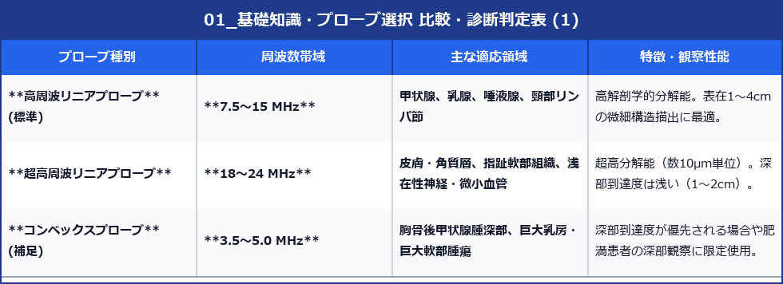

# 表在超音波検査 基礎知識・プローブ選択・画像最適化

> [!NOTE] 概要
> 表在超音波検査（甲状腺・乳腺・唾液腺・表在軟部組織）は、浅在性器官の高分解能観察を目的とします。
> 最適なプローブ選択と、Gain、Focus、周波数、カラードプラ/パワードプラ/エラストグラフィのパラメータ調整が、精度高い診断の絶対条件となります。

---

## 1. プローブの選択と周波数特性

---

## 2. 画質最適化パラメータ設定（Bモード）

### (1) 周波数 (Frequency) 設定
- **基本原則**: 目的部位の深さに合わせて最高周波数を選択。
- **浅部（<2cm）**: 高周波（12〜18MHz）に設定し、空間分解能を最大化。
- **深部（>3cm）**: 減衰が強いため、やや周波数を下げて（7.5〜10MHz）浸透度を確保。

### (2) フォーカス位置 (Focus Position)
- 観察・計測対象となる結節や組織の**最下縁レベル**、または**中心レベル**にシングルフォーカスを設定。
- マルチフォーカスはフレームレート（画面更新速度）が低下するため、運動周期や血流観察時はシングルフォーカスを推奨。

### (3) ゲイン (Gain) ＆ dynamic range (ダイナミックレンジ)
- **TGC (Time Gain Compensation)**: 皮下脂肪層〜乳腺/甲状腺実質〜深部筋層までエコー輝度が一様になるようリニアに傾斜調整。
- **Dynamic Range**: 55〜65 dB程度が標準。硬質感・コントラストを強めたい場合は低めに設定（50〜55dB）。

---

## 3. ドプラ超音波の最適化 (Doppler Optimization)

### (1) カラードプラ vs パワードプラ vs 高感度微細血流イメージング (SMI/MV-Flow等)
- **カラードプラ (Color Doppler)**: 流速と血流方向の評価。甲状腺バセドウ病のThyroid inferno診断などに必須。
- **パワードプラ (Power Doppler)**: 感度が高く、流速依存性が低い。低流速・微細血管（乳癌結節内血流、リンパ節門部血流）の検出に適する。
- **高感度微細血流モード (SMI/MV-Flow/microV)**: 低流速・微小血管のクラッタノイズを分離除去し、腫瘍内の微細血管構築（Branching/Spiculation）を描出。

### (2) ドプラ設定パラメータの要点
- **PRF (Pulse Repetition Frequency) / Velocity Scale**: 表在領域では低流速血流が中心のため、**3.0〜6.0 cm/s** (PRF 1000〜1500 Hz) に低く設定。
- **Wall Filter**: 低設定（Low）にして低流速信号の欠損を回避。
- **Color Gain**: ノイズが出現する直前の限界高ゲインに設定。

---

## 4. エラストグラフィ (Elastography)

組織の硬度（弾性）を視覚化・数値化する診断技術。

### (1) 歪みエラストグラフィ (Strain Elastography: SE)
- 手振れや心脈波・手動圧迫による組織の歪みを測定。
- **Strain Ratio (SR)**: 腫瘍の歪みと周囲正常組織の歪みの比率を算出。
- 乳腺・甲状腺結節の良悪性鑑別に汎用。

### (2) せん断波エラストグラフィ (Shear Wave Elastography: SWE)
- アコースティックラディエーションフォース（ARFI）を用いて組織内にせん断波を発生させ、伝播速度 ($m/s$) やヤング率 ($kPa$) を絶対値として測定。
- 検者依存性が低く、客観的再現性に優れる。

> [!TIP] 臨床ワンポイント
> 表在超音波では、プローブを皮膚に押し付けすぎると組織が圧迫されて硬度が人工的に高く測定される（Strain artifact）。たっぷりのゼリー（ゼリーパッド）を使い、無圧迫状態で測定することが精度維持の鍵です。
