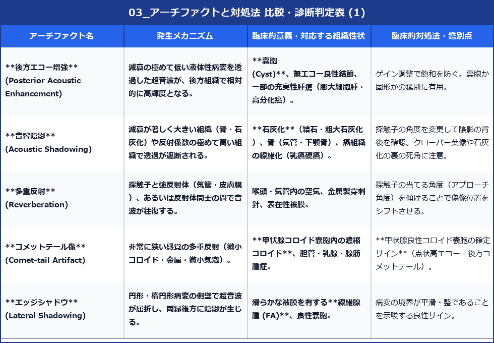

# 表在超音波 アーチファクトの解剖と臨床鑑別マニュアル

> [!NOTE] 概要
> 表在超音波領域では、音響特性の違いによって多彩なアーチファクト（偽像）が生じます。
> これらは誤診の原因（ピットホール）となる一方、結節の性状（微小石灰化、嚢胞、粗大石灰化、気体）を判定する**重要な診断手がかり**でもあります。

---

## 1. 代表的アーチファクト一覧とメカニズム

---

## 2. 表在領域特有のピットホールと対策

### (1) 点状高エコーの鑑別：微小石灰化 vs 濃縮コロイド (コメットテール)
- **乳頭癌の微小石灰化 (Psammoma bodies)**:
  - 1mm以下の点状高エコー。**後方影を伴わない**ことが多い。腫瘍内部に集密。
- **コロイド嚢胞の微小コロイド結晶**:
  - 点状高エコーの直後に**V字状または線状の後方コメットテール像**を伴う。良性の確証。

> [!WARNING] 診断上の注意点
> コメットテール像を微小石灰化と誤認して穿刺吸引細胞診（FNA）をオーバーダイアグノシスしないよう、高分解能で後方エコーの引き尾（Comet tailing）を慎重に観察してください。

### (2) 接触不良・エア介在による減衰偽像
- 頸部や乳房の凹凸部では、プローブと皮膚の間にエアが入り、音響陰影に似た画像欠損が生じる。
- **対策**: 十分な超音波ゼリーの塗布、およびスタンドオフパッドの使用。

### (3) ドプラにおけるクラッタノイズ (Clutter Artifact)
- 患者の呼吸、拍動、体動、または検者の手振れにより、組織全体の移動がドプラ信号として検出される（カラーフラッシュ）。
- **対策**: ウォールフィルター（Wall Filter）を適度にあげる、または患者に「息止め」を指示する。
