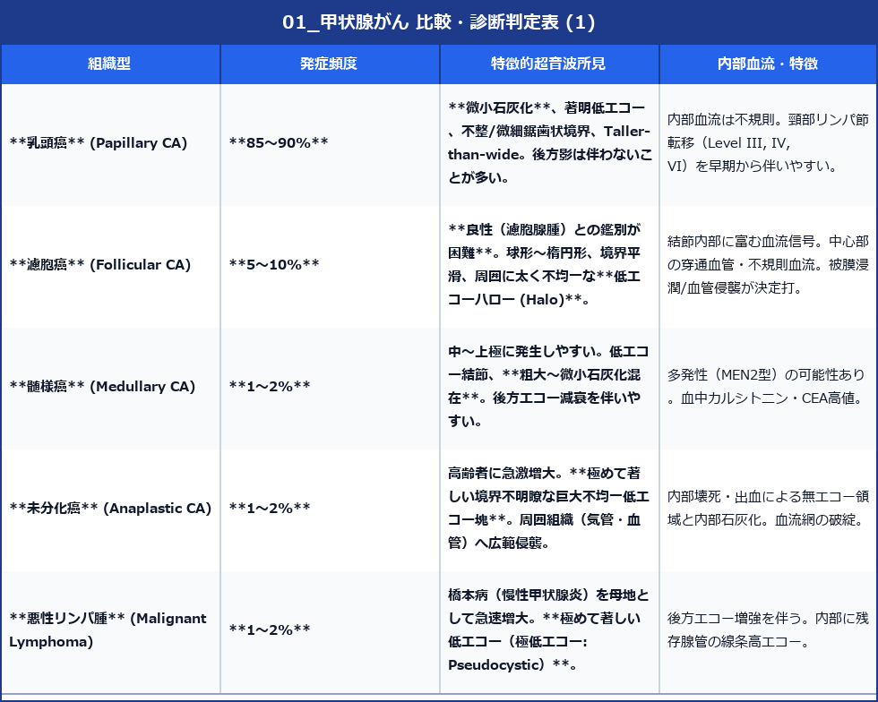

# 甲状腺がん (Thyroid Cancer) 超音波診断バイブル

> [!NOTE] 概要
> 甲状腺悪性腫瘍は病理組織型（乳頭癌、濾胞癌、髄様癌、未分化癌、悪性リンパ腫）によって著しく異なる超音波像を示します。
> 超音波画像による悪性所見の評価は、日本超音波医学会 (JSUM) / 日本甲状腺学会の診断基準（パターン診断）および ACR TI-RADS（米国放射線学会ポイント制）における針生検（FNA）適応判定の核心となります。

---

## 1. 悪性を示唆する超音波5大所見

1. **形状 (Shape)**: **前後径 > 横径 (T/N ratio > 1 / Taller-than-wide)**
2. **境界・辺縁 (Margin)**: **微細鋸歯状 (Microlobulated)** または **極めて不整 (Spiculated / Irregular)**
3. **内部エコー (Echogenicity)**: **著明な低エコー (Marked / Very Hypoechoic)**（※日本基準では前頸筋群と同等またはそれ以上に低い。ACR TI-RADSでは前頸筋群よりもさらに低い more hypoechoic と規定）
4. **石灰化 (Calcification)**: **微小石灰化 (Microcalcifications: <1mmの点状高エコー)**
5. **被膜浸潤・リンパ節転移 (Invasion & Metastasis)**: 被膜破綻、頸部リンパ節の丸型化・石灰化・嚢胞変性

---

## 2. 病理組織型別 超音波所見一覧

---

## 3. 超音波ガイド下針生検 (FNAB) の適応基準

- **微小石灰化または悪性高リスク所見あり**: **結節径 ≧ 10 mm** でFNA適応。
- **中等度リスク (低エコー、境界平滑)**: **結節径 ≧ 15 mm** でFNA適応。
- **低リスク (等/高エコー、海綿状)**: **結節径 ≧ 20 mm** または経過観察。
- **気管・反回神経直近・被膜浸潤疑い、または悪性疑いリンパ節存存時**: 10mm未満でもFNA検討。
