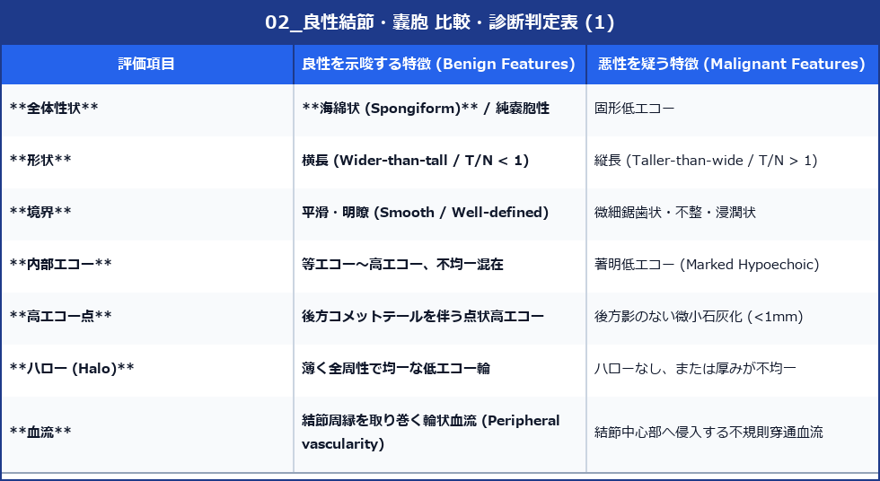

# 甲状腺 良性結節・嚢胞 超音波診断バイブル

> [!NOTE] 概要
> 甲状腺の良性病変（腺腫様甲状腺腫、濾胞腺腫、嚢胞変性）は無症状で偶然発見されることが多く、不要な侵襲的検査（FNA）を回避するための超音波による正確な良性判定が要求されます。

---

## 1. 代表的良性病変の所見一覧

### (1) 腺腫様甲状腺腫 / 腺腫様結節 (Adenomatous Goiter / Adenomatous Nodule)
- **病態**: 甲状腺実質の一部が過形成を起こした非腫瘍性病変。多発することが多い。
- **超音波所見**:
  - **多発性結節**: 左右葉に多彩なエコー輝度（高・等・低エコー）の結節が混在。
  - **Halo (薄い低エコーハロー)**: 薄く均一な被膜様低エコー輪。
  - **嚢胞変性 (Cystic degeneration)**: 結節内部に液状化による無エコー領域を伴う。
  - **コロイド結晶**: 内部にコメットテール像を伴う点状高エコー。

### (2) 濾胞腺腫 (Follicular Adenoma)
- **病態**: 真の良性上皮性腫瘍。通常単発性。
- **超音波所見**:
  - 楕円形〜丸型、境界明瞭かつ平滑。
  - **薄く連続した低エコーハロー (Thin Halo)**。
  - 内部は均一な等エコーまたはやや高エコー。

### (3) コロイド嚢胞・単純嚢胞 (Colloid Cyst / Simple Cyst)
- **超音波所見**:
  - **無エコー (Anechoic)**、境界明瞭平滑、**後方エコー増強 (Posterior Enhancement)**。
  - **コメットテール像 (Comet-tail artifact)**: 嚢胞内に浮遊または壁着するコロイド結晶による強力な良性確証サイン。

---

## 2. 良性判定マトリックス

