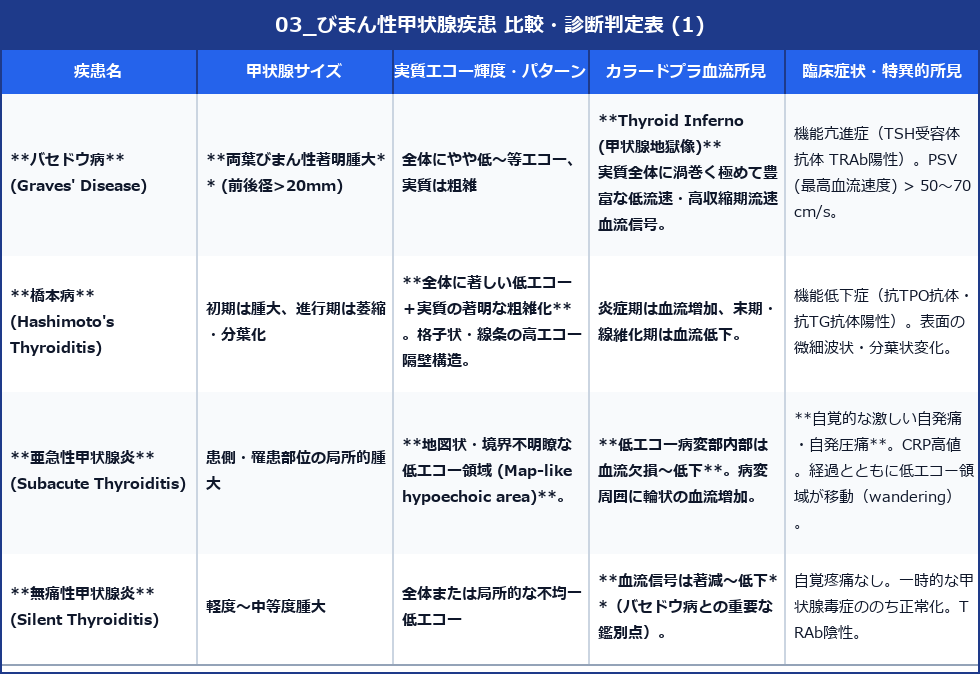

# びまん性甲状腺疾患 (Diffuse Thyroid Diseases) 超音波診断バイブル

> [!NOTE] 概要
> びまん性甲状腺疾患は甲状腺全体に炎症や機能異常が及ぶ病態で、バセドウ病、橋本病（慢性甲状腺炎）、亜急性甲状腺炎、無痛性甲状腺炎などが含まれます。
> 甲状腺のサイズ、実質のエコー輝度・均一性、およびカラードプラによる血流量評価が鑑別の核心となります。

---

## 1. 代表的びまん性疾患の比較鑑別マトリックス





---

## 2. バセドウ病 vs 無痛性甲状腺炎の鑑別チャート

両者ともに甲状腺ホルモン高値（甲状腺毒症）を呈するため、超音波ドプラ評価が鑑別の決め手となります。

```
[ 甲状腺機能亢進・毒症症状 (FT3/FT4 高値) ]
  ↓
[ 超音波カラードプラ / パワードプラ評価 ]
  ├─★ 【血流信号が極めて豊富】 (Thyroid Inferno)
  │    └─ 上/下甲状腺動脈 PSV > 50 cm/s  ==>  バセドウ病 (Graves' Disease)
  │
  └─★ 【血流信号が低下〜乏しい】
       └─ 上/下甲状腺動脈 PSV < 40 cm/s  ==>  無痛性甲状腺炎 (Silent Thyroiditis)
```

---

## 3. 橋本病（慢性甲状腺炎）の進行度と結節合併

- **Giraffe-skin / Micronodular pattern**: 橋本病初期〜中期に見られる、線維化隔壁に囲まれた小斑状低エコー（キリンの柄状パターン）。
- **悪性リンパ腫の併発リスク**: 橋本病経過観察中に、急速に増大する極度の低エコー病変（Pseudocystic）が出現した場合は**甲状腺原発悪性リンパ腫**を強く疑い細胞診を行う。
