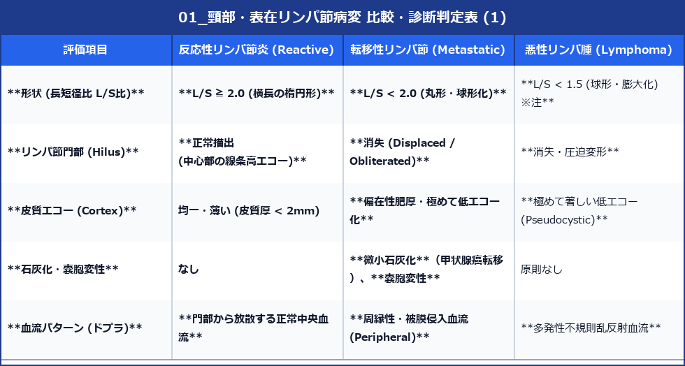

# 頸部・表在リンパ節病変 超音波診断バイブル

> [!NOTE] 概要
> 頸部および表在リンパ節病変（反応性・転移性・悪性リンパ腫・亜急性壊死性リンパ節炎等）の鑑別は、癌の病期診断や感染症診断において極めて重要な役割を果たします。

---

## 1. 反応性リンパ節炎 vs 転移性リンパ節 vs 悪性リンパ腫の鑑別マトリックス

> [!TIP] L/S比評価の臨床的ポイントとピットホール
> - **一括カットオフ基準**: JSUM学会標準では「**L/S < 2.0**」が悪性疑い（丸型化）の単一基準です。「L/S < 1.5」は悪性リンパ腫で著明な球形膨大化（Pseudocystic pattern）を呈する際の参考臨床指標です。
> - **解剖的ピットホール (Level I / II)**: 顎下部 (Level I) や上頸部 (Level II) の反応性リンパ節は、解剖学的に元々やや丸みを帯びやすい（L/S比が2.0未満になりやすい）。L/S比のみで悪性と判断せず、**門部エコーの有無・皮質偏在性肥厚・血流パターン**を必ず総合評価してください。

---

## 2. 特殊なリンパ節病変の超音波像

### (1) 転移性頸部リンパ節の原発巣推定（吉川式特徴）
- **甲状腺乳頭癌転移**: **内部高エコー斑 (Echogenic foci / Thyroid-like focus)**、**微小石灰化**、および**嚢胞変性 (Cystic necrosis)** が特徴（特に Level III, IV, VI に多発）。
- **下咽頭・喉頭・口唇 扁平上皮癌 (SCC) 転移**: 門部消失、丸型化、**内部の著しい中央壊死（無エコー領域）**、および被膜外浸潤（周縁の高エコー脂肪紡錘像）。
- **悪性黒色腫 (Melanoma) 転移**: **極めて著しい低エコー（ほぼ無エコー状）**＋豊かな内部血流。

### (2) 亜急性壊死性リンパ節炎 (菊池病: Kikuchi-Fujimoto Disease)
- **好発**: 若年女性に多い、発熱・圧痛を伴う後頸三角〜上中頸部リンパ節腫脹。
- **吉川式チェックポイント**:
  - レベルII〜Vに多発する小型〜中型のリンパ節。
  - **リンパ節周囲脂肪組織の著しい高エコー化 (Perinodal hyperechoic fat / Fat stranding)**。
  - 門部高エコーは保たれることが多く、自発痛・圧痛に一致した病変。

### (3) 結核性頸部リンパ節炎 (Tuberculous Lymphadenitis)
- **特徴**: 複数リンパ節の融着・一体化 (**Matted nodes**)、内部チーズ様壊死による多房性嚢胞変性、周囲被膜破綻および皮下瘻孔形成。

---

## 3. 頭頸部固有の正中・側頸部嚢胞性病変（吉川まどか先生の著書より）

### (1) 正中頸嚢胞 (甲状舌管嚢胞: Thyroglossal Duct Cyst)
- **発生**: 発生期の甲状舌管の消退不全による正中病変。
- **超音波所見**:
  - **解剖位置**: 頸部正中、**舌骨 (Hyoid bone) 直下〜前開口部**に位置。
  - **特徴**: 無エコー〜内部デブリスを含む低エコー嚢胞。
  - **動的観察**: 患者に**「舌を突き出してもらう（舌突き出し指示）」**または嚥下させると、舌骨の動きと同調して頭側に引っ張られる動的変化（Tongue protrusion sign）。

### (2) 側頸嚢胞 (第2鰓裂嚢胞: Second Branchial Cleft Cyst)
- **発生**: 第2鰓弓・鰓裂の遺残。
- **超音波所見**:
  - **解剖位置**: **胸鎖乳突筋 (SCM) 前縁、総頚動脈分岐部 (Carotid bifurcation) の表層**。
  - **特徴**: 境界平滑な円形〜楕円形無エコー/均一低エコー（感染を伴うと内部デブリス・壁肥厚）。後方エコー著明増強。
