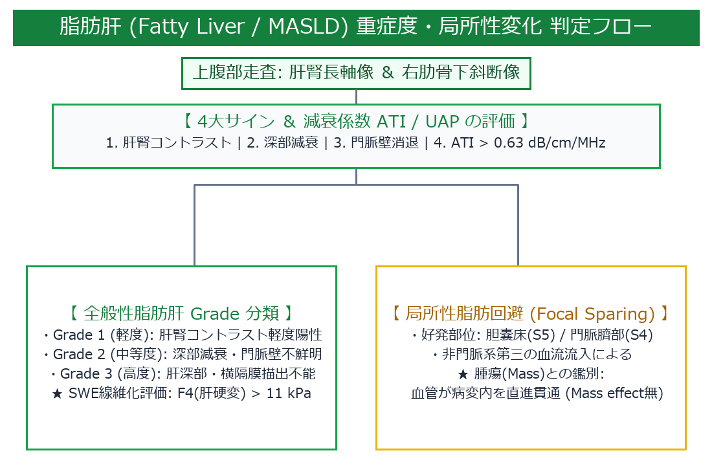

# 脂肪肝 (Fatty Liver / Hepatic Steatosis / MASLD) 超詳細診断プロトコル

> [!NOTE] 概要
> 脂肪肝は肝細胞の30%以上に中性脂肪（トリグリセリド）が異常蓄積した状態です。近年の国際分類（MASLD / NAFLD）や、超音波衰減係数 (ATI / UAP)・超音波エラストグラフィ (SWE) による定量評価を含め、日本超音波医学会 (JSUM) 判定基準に基づき極めて深く解説します。

---

## 1. 脂肪肝判定 ＆ 局所性異常 診断アルゴリズム

---

## 2. 病態生理と音響特性 (Acoustic Physics)

1. **輝度上昇 (Bright Liver)**:
   - 肝細胞内の脂肪滴（Fat droplets）と細胞質の間で音響インピーダンスの不連続性が生じ、微小な屈折・散乱（Rayleigh-Gould scattering）が著しく増加するため、後方散乱波が増強して高エコーを呈する。
2. **深部減衰 (Deep Attenuation)**:
   - 脂肪組織は超音波の吸収減衰係数が高いため、音束が肝深部に達するにつれて音響エネルギーが著しく減衰し、深部エコーレベルが低下する。
3. **血管壁不鮮明化 (Vascular Blurring)**:
   - 肝実質自体のエコーレベルが上昇して門脈壁（高エコー）との輝度差が減少するため、門脈壁の輪郭が相対的に消失する。

---

## 3. Bモード判定の4大エコーサインと重症度スコアリング (JSUM Score)

![[auto_table_01_肝臓_脂肪肝_1.png]]
---

## 4. 定量評価技術 (Quantitative Steatosis Imaging)

### 1) 超音波減衰係数 (ATI / UAP / CAP)
- **$S_0 \to S_1$ (軽度脂肪化 ≧ 5〜10%)**: **> 0.63 ～ 0.68 dB/cm/MHz** (CAP > 248 dB/m)
- **$S_2$ (中等度 ≧ 33%)**: **> 0.72 dB/cm/MHz** (CAP > 268 dB/m)
- **$S_3$ (高度 ≧ 66%)**: **> 0.80 dB/cm/MHz** (CAP > 280 dB/m)

### 2) 剪断波エラストグラフィ (Shear Wave Elastography: SWE)
- **$F_0 - F_1$ (線維化なし～軽度)**: $E < 6.0～7.0 \text{ kPa}$ ($V_s < 1.4 \text{ m/s}$)
- **$F_4$ (肝硬変)**: $E > 11.0～12.0 \text{ kPa}$ ($V_s > 1.9～2.0 \text{ m/s}$)

---

## 🔗 関連リンク
- [[00_MOC_目次|MOC目次へ戻る]]
- [[02_臓器別解剖と標準描出/肝臓_解剖と描出法|肝臓：解剖と描出法]]
- [[03_疾患別超音波所見/肝臓_肝硬変|肝硬変 (Liver Cirrhosis)]]
- [[03_疾患別超音波所見/肝臓_肝細胞がん|肝細胞がん (HCC)]]