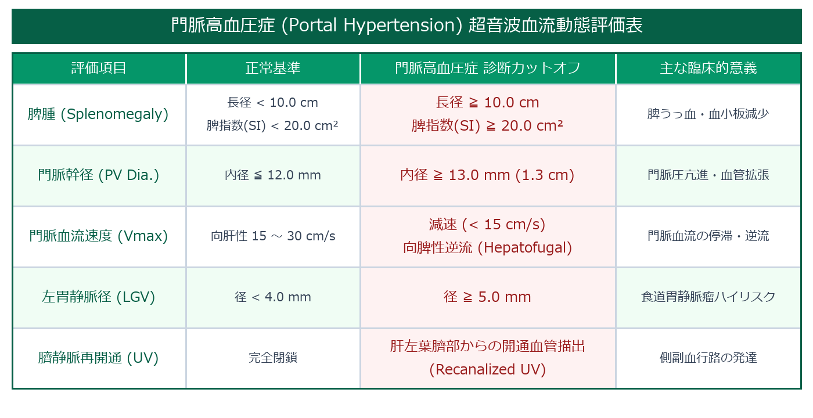

# 肝硬変 (Liver Cirrhosis: LC) 超詳細診断プロトコル

> [!NOTE] 概要
> 肝硬変は持続する肝細胞障害・再生・線維化により肝構造が改築され、門脈圧亢進症・肝不全を呈する終末期病態。超音波では肝形態変化・表面凹凸・血流動態変化・エラストグラフィによる線維化評価を統合して診断する。

---

## 1. 肝形態・表面の評価

### 肝形態変化（萎縮・肥大パターン）
| 部位 | 変化 | 理由 |
|------|------|------|
| **右葉** | 萎縮 | 線維化・再生結節による実質破壊 |
| **左葉外側区（S2・S3）** | 肥大 | 代償性肥大 |
| **尾状葉（S1）** | 肥大 | 独立した門脈・肝静脈流入による代償 |

### 尾状葉/右葉比（C/RL Ratio）
- 上腹部正中横断像でIVC直前の尾状葉横径(C)÷右葉横径(RL)を計測
- **C/RL > 0.65**：肝硬変の感度73%・特異度90%

### 肝表面・辺縁
- **被膜の凹凸（Nodular surface）**：高周波プローブ（7〜12 MHz）で表面の結節状不整を確認
- **辺縁鈍化**：肝右葉下縁の角が鈍くなる（正常は鋭角）
- **肝実質の粗雑化**：エコーテクスチャが不均一・粗粒状

---

## 2. 肝実質内所見

| 所見 | 内容 |
|------|------|
| **再生結節** | 等〜低エコーの小結節（5〜10 mm）が散在 |
| **線維性隔壁** | 結節を囲む高エコー線維性帯 |
| **粗雑不均一エコー** | 正常の均一エコーが失われ、まだら状に |
| **肝内血管走行異常** | 肝静脈の走行蛇行・狭小化 |

---

## 3. 門脈圧亢進症の評価



### 主要計測値

| 計測項目 | 正常値 | 門脈圧亢進 |
|---------|-------|---------|
| **門脈本幹径** | < 13 mm | **≥ 13 mm** |
| **脾静脈径** | < 8 mm | ≥ 8 mm |
| **脾長径** | < 10 cm | > 10 cm（脾腫）|
| **門脈血流速度** | 15〜20 cm/s | < 10 cm/s（低下）|
| **門脈血流方向** | 向肝性 | **向脾性（逆流）**：高度PH |

### 側副血行路（Collateral Circulation）
> [!IMPORTANT] 側副血行路の確認は必須
> - **食道静脈瘤**：食道下部・胃噴門部の静脈拡張（上部消化管内視鏡で確認）
> - **脾腎シャント**：脾静脈〜左腎静脈への短絡血流
> - **臍静脈再開通（Paraumbilical vein）**：肝円靭帯内の静脈再開通（カラードプラで確認）
> - **胃短静脈拡張**：脾門部〜胃底部の静脈拡張

---

## 4. 肝静脈波形分類（Hepatic Vein Waveform）

| 分類 | 波形パターン | 臨床意義 |
|------|------------|---------|
| **HV-0（Triphasic）** | 正常3相波形（心周期に応じた拍動性） | 正常 |
| **HV-1（Biphasic）** | a波消失・2相性 | 軽度線維化 |
| **HV-2（Monophasic）** | 拍動性消失・平坦化 | 高度線維化・肝硬変 |

---

## 5. 剪断波エラストグラフィ（SWE）による線維化評価

| 線維化ステージ | Metavir | SWE（kPa） | 臨床的意義 |
|-------------|---------|-----------|---------|
| F0〜F1 | 線維化なし〜軽度 | < 6.0〜7.0 | 経過観察 |
| F2 | 中等度線維化 | 7.0〜9.0 | NASH・ウイルス性肝炎の治療検討 |
| F3 | 高度線維化 | 9.0〜11.0 | 肝硬変境界・HCCサーベイランス開始 |
| **F4** | **肝硬変** | **> 11.0〜12.0** | **HCCサーベイランス必須** |

---

## 6. 腹水の評価

| 評価部位 | 検出のコツ |
|---------|----------|
| **モリソン窩（肝腎間隙）** | 仰臥位での最初の確認部位 |
| **ダグラス窩** | 骨盤腔の液体貯留 |
| **左横隔膜下** | 脾周囲の液体貯留 |

> [!TIP] 腹水量の推定
> - 少量：モリソン窩のみ
> - 中等量：両側腹腔・骨盤腔
> - 大量：腸管が腹水中に浮く「浮遊腸管像」

---

## 7. スキャン手順

1. **肝形態評価**：C/RL比計測・右葉萎縮・尾状葉肥大
2. **表面評価**：高周波プローブで被膜凹凸
3. **実質評価**：粗雑化・再生結節
4. **門脈計測**：本幹径・血流速度・方向（カラードプラ）
5. **側副血行路探索**：臍静脈・脾腎シャント
6. **脾腫確認**：長径計測
7. **腹水確認**：モリソン窩・骨盤腔
8. **HV波形**：パルスドプラで波形分類
9. **SWE**：線維化ステージ評価

---

## 8. レポート記載例

```
肝臓：右葉萎縮・尾状葉肥大。C/RL比 0.72（> 0.65、肝硬変域）。
肝表面は高周波プローブにて結節状凹凸あり。実質エコー粗雑・不均一。
門脈本幹径 15 mm（拡張）。血流速度 9 cm/s（低下）・向肝性。
臍静脈再開通あり（カラードプラにて確認）。
脾臓長径 13 cm（脾腫）。腹水：モリソン窩に少量。
HV波形：HV-2（平坦化）。SWE：14.5 kPa（F4 肝硬変域）。
肝硬変の超音波所見。HCCサーベイランスを推奨する。
```