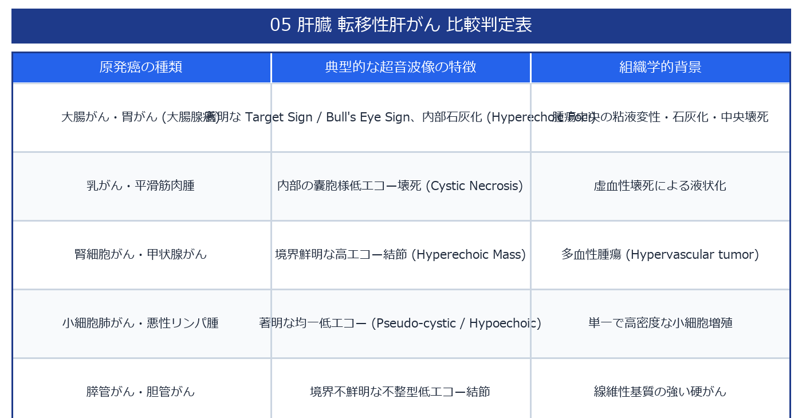

# 転移性肝がん (Metastatic Liver Tumor) 超詳細診断プロトコル

> [!NOTE] 概要
> 転移性肝がんは大腸がん・胃がん・膵がん・乳がん・肺がん等が門脈または肝動脈経由で播種する病態。多発性・両葉性が特徴で、原発巣不明癌の初発発見場所となることも多い。超音波はスクリーニング・経過観察の主役。

---

## 1. 特徴的な超音波所見

### ✅ 多発性・両葉性
- 両葉にわたる**多発結節**が最大の特徴
- 背景肝は通常**正常エコー**（肝硬変なし）

### ✅ Bull's Eye Sign（Target Sign）
- **中央高エコー**（凝固壊死巣）＋**周縁厚い低エコー帯**（活発な癌浸潤帯）
- 直径 2〜5 cm の結節に典型的

### ✅ その他の重要所見




---

## 2. 原発巣別の特徴的超音波エコーパターン


---

## 3. カラードプラ・造影超音波（Sonazoid CEUS）所見

### カラードプラ
- 結節**周縁に沿う血管信号**（Peripheral Rim Vascularity）
- 内部は血流乏しい（壊死中心のため）

### Sonazoid CEUS


> [!IMPORTANT] Kupffer相の威力
> Kupffer細胞を持たない転移巣はすべて欠損として浮き上がる。BモードやCT/MRIで見えない**微小転移（< 5 mm）の検出**に最も優れる。

---

## 4. スキャン手順

1. **系統的肝スキャン**：全肝を縦・横断でくまなく観察
2. **結節数・分布の確認**：単発か多発か・両葉性か
3. **各結節の評価**：エコーパターン・Bull's eye・サイズ
4. **表面所見**：Umbilication / Extrusion sign
5. **カラードプラ**：周縁血流パターンの確認
6. **肝門部・傍大動脈リンパ節**：転移リンパ節の確認
7. **腹水**：癌性腹膜炎の合併
8. **他臓器への浸潤**：原発巣推定のための周囲臓器評価

---

## 5. 鑑別診断


---

## 6. 経過観察での超音波の役割


---

## 7. レポート記載例

```
肝臓：S4・S6・S7に径 1.5〜3.2 cm の多発結節を認める（計4個）。
各結節は中央高エコー＋周縁低エコー帯（Bull's eye pattern）を呈する。
肝表面：S6病変部に Umbilication sign あり。
カラードプラ：各結節の周縁に沿うリム状血流シグナル。
背景肝エコーは正常。腹水なし。
転移性肝がんとして矛盾しない。原発巣の検索・腫瘍科紹介を推奨する。
```