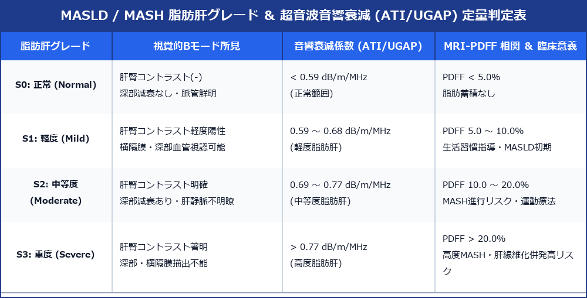

# MASLD / MASH ＆ 超音波音響衰減 (ATI / UGAP) 脂肪定量診断プロトコル

> [!NOTE] 概要
> 2023-2024年の国際合同学会改訂により、従来の NAFLD/NASH は **MASLD (代謝異常関連脂肪性肝疾患)** および **MASH (代謝異常関連脂肪肝炎)** へ名称が統一されました。超音波検査は、従来のBモード定性評価（肝腎コントラスト等）に加え、**超音波音響衰減係数 (ATI / UGAP: dB/m/MHz)** による客観的な脂肪量定量（S0～S3）が最新の診断標準となっています。

---

## 1. MASLD 脂肪肝判定 ＆ 超音波定量マトリックス

---

## 2. 視覚的Bモードスコア vs 超音波音響衰減 (ATI / UGAP)

### 1) 従来の視覚的4大Bモードサイン
- **肝腎コントラスト (Liver-Kidney Contrast)**: 肝実質が右腎皮質より明らかな高エコー。
- **肝実質高エコー化 (Bright Liver)**: 微細エコーが密に上昇。
- **深部衰減 (Deep Attenuation)**: 超音波エネルギーが衰減し、深部（横隔膜付近）が暗く減衰。
- **肝内血管描出不良 (Vessel Blurring)**: 肝静脈枝や門脈壁の輪郭が不鮮明化。

### 2) 最新の超音波音響衰減係数 (ATI / UGAP) 定量評価
- **物理原理**: 脂肪滴による超音波ビームの散乱・吸収減衰率を測定。
- **計測手技**: 右葉 intercostal 走査。肝包膜下 1～2 cm を避け、血管・胆管を含まない実質内に ROI (1.5 × 3.0 cm) を設定。
- **カットオフ値**:
  - **S0 (正常)**: < 0.59 dB/m/MHz (MRI-PDFF < 5%)
  - **S1 (軽度)**: 0.59 ～ 0.68 dB/m/MHz (MRI-PDFF 5 ～ 10%)
  - **S2 (中等度)**: 0.69 ～ 0.77 dB/m/MHz (MRI-PDFF 10 ～ 20%)
  - **S3 (重度)**: > 0.77 dB/m/MHz (MRI-PDFF > 20%)

---

## 3. 臨床対応 ＆ レポート記載例

`
【超音波所見】
肝実質：明らかな肝腎コントラストの上昇および中等度の深部減衰を認める。
音響衰減係数 (ATI): 0.73 dB/m/MHz（S2: 中等度 MASLD 相当）。
肝辺縁：整、表面平滑。局所性脂肪脱落域なし。

【印象】
中等度 MASLD (S2 相当)。MASH 進展予防のため食事・運動療法および代謝スクリーニングを推奨。
`
