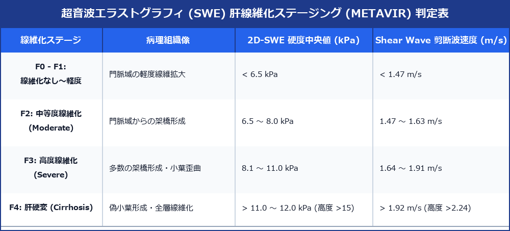

# 超音波エラストグラフィ (SWE) 肝線維化 ＆ 組織硬度測定プロトコル

> [!NOTE] 概要
> Shear Wave Elastography (SWE: 剪断波エラストグラフィ) は、超音波押し出しパルス (AFI) により組織内に発生させた剪断波の伝播速度 (v: m/s) を測定し、組織の弾性率 (ヤング率 E: kPa) を数値化する技術です。肝硬変・肝線維化ステージング (F0～F4) の非侵襲的診断基準として世界的に標準化されています。

---

## 1. 肝線維化ステージング (METAVIR) ＆ SWE数値マトリックス

---

## 2. 正確な SWE 計測手技 (Standard Measurement Technique)

> [!IMPORTANT] 測定精度を保つための5大条件
> 1. **患者姿勢**: 仰臥位、右腕を頭上に挙上（肋間を広げる）。
> 2. **息止め (Breath-hold)**: 呼気末の自然な安静息止め（深息止め・バルサルバ回避）。
> 3. **ROI 設定位置**: 肝右葉 S5/S6 肋間像。**肝包膜下 1.5 ～ 2.0 cm 深部**（近位ノイズ回避）。大きな血管・胆管を避けた肝実質。
> 4. **測定回数**: **10回以上**の有効測定。
> 5. **品質管理基準 (Reliability)**: **IQR / Median (四分位範囲/中央値比) < 30%** を満たすデータのみを採用。

---

## 3. 乳腺・甲状腺へのSWE適応

- **乳腺病変**: 良性（乳腺腺腫: < 30 kPa） vs 悪性（乳がん: > 80 ～ 100 kPa）。腫瘍の硬さと辺縁硬度（Stiff rim sign）を評価。
- **甲状腺結節**: 悪性結節（乳頭がん等）で SWE 硬度の上昇を認める。

---

## 4. レポート記載例

`
【超音波所見】
肝硬度測定 (2D-SWE):
・測定部位: 肝右葉 (S5 肋間像)
・測定回数: 10/10 成功
・硬度中央値 (Median): 9.4 kPa (剪断波速度: 1.77 m/s)
・四分位範囲 (IQR/Median): 14.2%（良好な信頼性）

【印象】
高度肝線維化 (METAVIR F3 相当)。肝硬変進展予防の定期モニタリングを推奨。
`
