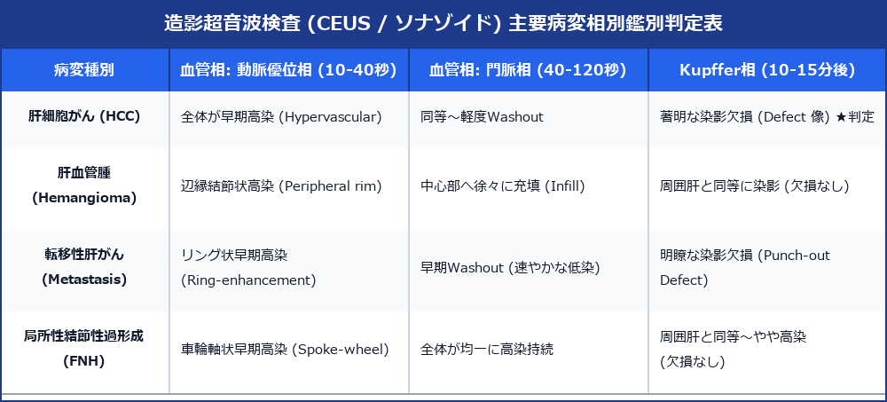

# 造影超音波検査 (CEUS / ソナゾイド) 診断 ＆ ガイドラインプロトコル

> [!NOTE] 概要
> 造影超音波検査 (CEUS) は、微小気泡造影剤（ソナゾイド Sonazoid）を静脈投与し、リアルタイムで血流灌流（血管相）および網内系・Kupffer細胞への取り込み（Kupffer相）を観察する診断法です。CT/MRIに比べアレルギーや腎機能障害の制約が少なく、肝細胞がん (HCC) の確定診断や治療効果判定における金種です。

---

## 1. 主要病変の相別造影パターン判定マトリックス

---

## 2. 造影時相の定義 ＆ 観察ポイント

### 1) 血管相 (Vascular Phase)
- **動脈優位相 (Early Arterial Phase: 10 ～ 40秒)**: 腫瘍の血流供給源（動脈性血流）を評価。HCCでは全周性早期高染 (Hypervascular)。
- **門脈相 / 門脈晩期 (Portal / Late Phase: 40 ～ 120秒)**: 正常肝実質が濃染。腫瘍からの Washout 挙動を観察。

### 2) Kupffer相 (Post-Vascular / Kupffer Phase: 10 ～ 15分後)
- **病態原理**: ソナゾイド気泡は肝臓の Kupffer 細胞に貪食される。
- **判定**: Kupffer細胞が存在しない悪性腫瘍 (HCC, 転移性肝がん) は**著明な染影欠損 (Kupffer Defect)** として黒く抜ける。

> [!TIP] ソナゾイド再造影 (Re-injection / Defect Re-perfusion Sign)
> Kupffer相で欠損した部分に再度造影剤を注入することで、欠損部内の微小動脈血流をリアルタイムに再確認可能。

---

## 3. 胆嚢・腎・外傷への応用

- **胆嚢がん**: 胆嚢壁基底膜の断裂・肝線維への血流浸潤を血管相で同定。
- **腎 Bosniak 分類**: 腎嚢胞の微小隔壁血流を高感度同定。
- **外傷性器官破裂**: 肝・脾損傷部からの活動性血管外漏出 (Extravasation) を即時診断。

---

## 4. レポート記載例

`
【CEUS超音波所見】
ソナゾイド 0.015 mL/kg 静注：
・血管相 (22秒): 肝 S8 に径 22 mm の腫瘤影を認め、早期に強い全体高染を呈する。
・門脈相 (60秒): 周囲肝実質とほぼ同等の濃染を維持。
・Kupffer相 (12分後): 腫瘤部は明瞭な染影欠損 (Punch-out Defect) を呈する。
・再造影試験: 欠損部内に早期流入動脈血流を再現確認。

【印象】
S8 肝細胞がん (HCC: 典型例)。
`
