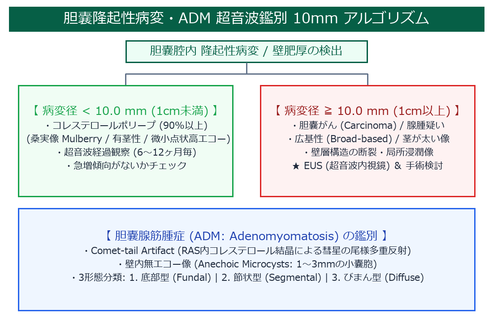
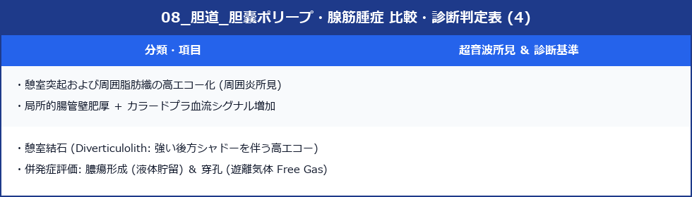

# 胆嚢ポリープ・胆嚢腺筋腫症 (ADM) 超詳細診断プロトコル

> [!NOTE] 概要
> 胆嚢内隆起性病変の大多数はコレステロールポリープ（良性）だが、10 mm以上では胆嚢がん（悪性）の危険率が急上昇する。胆嚢腺筋腫症（ADM）はRokitansky-Aschoff sinus（RAS）が特徴的な良性壁肥厚疾患。正確な鑑別が手術適応を決める。

---

## 1. 隆起性病変の10mm アルゴリズム



---

## 2. 胆嚢隆起性病変の鑑別


---

## 3. 10 mm カットオフルール

> [!IMPORTANT] 10 mm が手術適応の分岐点
> - **< 10 mm**：90%以上がコレステロールポリープ → 6〜12ヶ月ごと超音波経過観察
> - **≥ 10 mm**：胆嚢がん・前がん病変（腺腫）のリスク急上昇 → EUS精査・胆嚢摘出術検討

### 追加ハイリスク因子（10 mm未満でも要注意）


---

## 4. 胆嚢腺筋腫症（ADM）の超音波所見

### ADMとは
胆嚢壁の粘膜上皮が筋層内に陥入して形成される**Rokitansky-Aschoff sinus（RAS）** が特徴的な良性疾患。

### 特徴的な超音波所見


> [!IMPORTANT] 彗星尾アーチファクト（Comet-tail Sign）
> RAS内の濃縮胆汁・コレステロール結晶が超音波を多重反射し、後方に尾を引くような高エコー帯が出現する。この所見がADMの最も特異的なサイン。

### ADMの3形態分類




---

## 5. 胆嚢がんとの鑑別（最重要）


---

## 6. スキャン手順

1. **空腹状態**で検査（胆嚢充満）
2. **仰臥位・左側臥位**：胆嚢壁全体を系統的に評価
3. **隆起性病変の検出**：サイズ・形態・茎の有無
4. **移動性確認**：体位変換で動かない → 壁付着性
5. **カラードプラ**：ポリープ内血流・RASのtwinkling
6. **ADM評価**：彗星尾アーチファクト・RASの確認
7. **壁の連続性**：断裂・浸潤の有無（胆嚢がん除外）

---

## 7. レポート記載例（ポリープ）

```
胆嚢：体部後壁に径 7 mm の高エコー有茎性隆起を認める。
移動なし（壁付着性）。内部均一・高エコー・桑実状。
カラードプラにて内部血流シグナルなし。
コレステロールポリープとして矛盾しない。6ヶ月後の経過観察を推奨する。
```

## 8. レポート記載例（ADM）

```
胆嚢：底部に局所的壁肥厚（最大 8 mm）を認める。
肥厚壁内にRAS（小嚢胞様無エコー点）および彗星尾アーチファクトを確認。
胆嚢腺筋腫症（限局型）として矛盾しない。年1回の経過観察を推奨する。
```