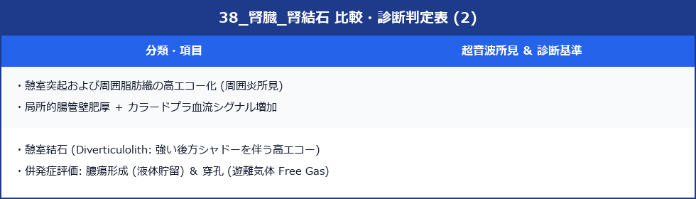

# 腎結石・尿管結石 (Nephrolithiasis / Ureterolithiasis)

> [!NOTE] 概要
> 腎・尿管結石は腹部超音波で描出できる最も一般的な尿路疾患の一つ。腎内の結石は高エコー＋音響陰影で典型的に描出されるが、尿管結石の描出には技術が必要。腎疝痛の初期評価として重要。

---

## 1. 超音波所見

### ✅ 腎結石の典型像
- **高エコー点〜帯状病変**（強い反射）
- **クリーンシャドウ（音響陰影）**：結石後方に明確な無エコー帯
- 腎洞（腎杯・腎盂）内に位置
- 体位変換で移動することがある（遊走結石）

### ✅ 結石サイズと描出能


---

## 2. 水腎症の合併評価

> [!IMPORTANT] 閉塞性水腎症の確認
> 尿管結石による閉塞があると上流に水腎症を生じる。
> - 腎盂・腎杯の拡張を確認
> - 尿管結石の好発部位（3ヶ所）を重点スキャン
> - 閉塞側の腎サイズ増大・浮腫も確認

---

## 3. 尿管結石の好発部位と描出

> [!IMPORTANT] 尿管の3つの狭窄部位（好発部位）
> 1. **UPJ（腎盂尿管移行部）**：腎盂直下、最も描出しやすい
> 2. **腸骨動脈交差部**：腸骨動脈前を尿管が横切る部位
> 3. **UVJ（膀胱尿管移行部）**：膀胱直前、充満膀胱を窓として描出





---

## 4. カラードプラ：Twinkling Artifact

> [!TIP] Twinkling Artifact（点滅アーチファクト）
> 結石にカラードプラをあてると、結石後方にカラーシグナルが点滅するように出現する現象。
> - 結石検出の感度を上げる
> - 小さな結石や音響陰影が不明確な場合に有用
> - カラードプラの PRF を低く設定すると出やすい

---

## 5. スキャン手順

1. **背臥位 + 側腹部走査**：腎洞内の高エコー病変を探索
2. **クリーンシャドウの確認**：高エコー病変の後方に音響陰影があるか
3. **水腎症の評価**：腎盂・腎杯の拡張
4. **カラードプラ**：Twinkling artifact の確認
5. **UVJ評価**：膀胱充満状態で膀胱三角部を確認
6. **対側腎の確認**：両側評価は必須

---

## 6. 腸ガスとの鑑別

> [!WARNING] 腸管ガスとの混同に注意
> 腸管内のガスも強い高エコー＋音響陰影を呈する。
> - 結石：腎洞内に固定・体位変換で移動しない（または緩徐に移動）
> - 腸ガス：腸蠕動で動く・形状が変化・腸管壁エコーを伴う

---

## 7. 鑑別診断


---

## 8. レポート記載例

```
左腎：腎盂内に径 7 mm の高エコー域を認め、後方に明確な音響陰影あり。
腎盂は軽度拡張（前後径 12 mm）。
左腎結石による軽度閉塞性水腎症として矛盾しない。
UVJ部（膀胱背側）に追加の結石像なし。
泌尿器科へのフォローアップを推奨する。
```
