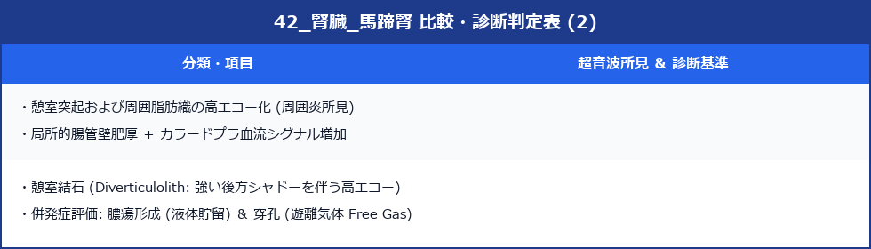

# 馬蹄腎 (Horseshoe Kidney)

> [!NOTE] 概要
> 馬蹄腎は左右の腎臓が峡部（isthmus）で癒合した先天性腎奇形で、発生頻度は約1/400〜1/600。多くは無症状の偶発所見だが、尿路感染・水腎症・腎結石・腎腫瘍の合併リスクが高い。腹部超音波での早期発見が重要。

---

## 1. 解剖学的特徴


---

## 2. 超音波所見

### ✅ 各腎の所見
- **腎長径が短め**（通常の腎より若干小さく見える）
- **腎下極が内側に傾いた配置**（V字・U字型）
- 腎下極が正中方向に向かう

### ✅ 峡部（Isthmus）の描出
- **大動脈・下大静脈の前方**に横走する腎実質エコー帯
- 峡部は腎実質と同一エコー輝度（腎組織）または線維性組織（低エコー）
- 腸管ガスによって描出が困難なことがある

> [!TIP] 峡部描出のコツ
> - 臍周囲を横断走査し、大動脈前方に帯状エコーが存在するか確認
> - 空腹時・腸管ガスの少ない状態が最適
> - 左右の腎下極を追いながら正中で連続するかを確認

---

## 3. 合併症と超音波評価





> [!WARNING] 合併症の定期チェックが重要
> 馬蹄腎では尿路の走行異常（UPJ の前方偏位）により尿流が滞りやすく、腎盂腎炎・結石・水腎症を繰り返しやすい。定期的な超音波フォローを推奨する。

---

## 4. 他の奇形との合併

> [!IMPORTANT] 他の先天性奇形との合併に注意
> 馬蹄腎は単独でも生じるが、以下の疾患に合併する頻度が高い：
> - **Turner症候群**（45,X）：Turner症候群女性の約15〜30%に合併
> - **Trisomy 18・13**
> - **心奇形・消化管奇形**

---

## 5. スキャン手順

1. **背臥位・臍部横断走査**：大動脈前方に峡部エコーがないか確認
2. **両腎の位置確認**：通常より内下方に位置していないか
3. **腎下極の方向確認**：内側に傾いていないか
4. **峡部の描出**：大動脈・IVC 前方の連続した腎実質エコー
5. **腎盂拡張の確認**：UPJ 閉塞による水腎症
6. **結石の有無**：腎洞内の高エコー＋音響陰影
7. **腎実質内腫瘤**：腎腫瘍合併の確認

---

## 6. 鑑別診断


---

## 7. レポート記載例

```
両腎：下極が内側に傾いた配置を呈し、臍部横断走査にて
腹部大動脈前方に腎実質と連続する帯状エコー（峡部）を認める。
馬蹄腎として矛盾しない所見。
右腎盂に軽度拡張（前後径 12 mm）あり、UPJ 閉塞性水腎症の合併を疑う。
腎結石の合併なし。泌尿器科フォローを推奨する。
```
