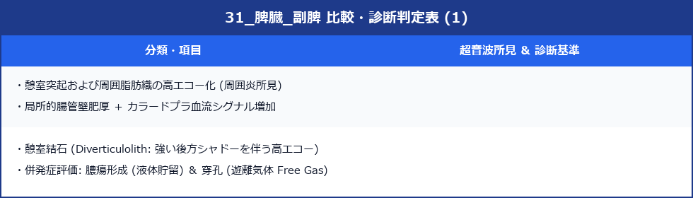

# 副脾 (Accessory Spleen)

> [!NOTE] 概要
> 副脾は脾臓と同一の正常脾組織が独立した結節として存在する先天性異常。健常人の約10〜30%に認められる偶発所見であり、悪性腫瘍との鑑別が最も重要な臨床課題。

---

## 1. 基本知識

### 好発部位（頻度順）




### サイズ
- 通常 **0.5〜3.0 cm**
- 多くは 1〜2 cm 前後の小結節

---

## 2. 超音波所見

### ✅ 典型的な超音波所見
- **脾臓と同一のエコー輝度・echotexture**（最重要！）
- **類円形〜楕円形**の境界明瞭・辺縁整な結節
- **脾門部に位置**することが多い
- **カラードプラ**：脾動脈からの独立した血管蒂を確認できることがある

> [!IMPORTANT] 最重要鑑別ポイント
> 副脾の診断に最も重要なのは**「脾臓と完全に同じエコー輝度・テクスチャ」**であること。
> 少しでも輝度が異なれば他疾患を疑う。

---

## 3. 鑑別診断


---

## 4. 鑑別に有用な検査

> [!TIP] 迷ったときの対処法
> - **造影超音波（CEUS）**：副脾は脾実質と全く同じ造影パターンを示す（最も確実）
> - **造影CT**：脾と同時に造影される（特に門脈相）
> - **シンチグラフィ**：変性赤血球（99mTc-硫黄コロイド）を摂取する

---

## 5. スキャン手順

1. **右側臥位 + 肋間走査**：脾門部周囲を丁寧にスキャン
2. **エコー輝度比較**：脾実質と病変の輝度を同一画面で比較
3. **カラードプラ**：血管蒂・血流パターンの確認
4. **サイズ計測**：最大径を2方向で計測
5. **周囲構造との関係**：膵尾部・左副腎との位置関係を確認

---

## 6. 脾摘後の副脾肥大

> [!IMPORTANT] 脾摘後の重要事項
> 特発性血小板減少性紫斑病（ITP）などで脾摘を行った後、残存していた副脾が代償性に**肥大**し、血小板減少が再燃することがある。
> - 脾摘後の血小板再減少では必ず副脾肥大を検索する
> - 肥大した副脾は数 cm 以上になることもある

---

## 7. レポート記載例

```
脾門部に径 1.5 cm の結節を認める。
内部エコー輝度・テクスチャは脾実質と同一。境界明瞭・辺縁整。
副脾として矛盾しない。悪性腫瘍との鑑別が必要な場合は造影検査を推奨する。
```
