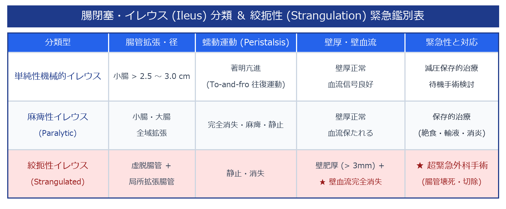

# 腸閉塞・イレウス (Ileus / Intestinal Obstruction) 超詳細診断プロトコル

> [!NOTE] 概要
> イレウスは腸内容物の通過障害。絞扼性イレウスは腸管壊死・穿孔・敗血症ショックを来す超緊急疾患。超音波はCTの前に行える迅速な初期評価として有用。腸管拡張・Keyboard sign・蠕動評価・血流評価を統合する。

---

## 1. イレウス分類




---

## 2. 腸閉塞の3大エコーサイン

### ① 腸管拡張


### ② Keyboard Sign（ザーゲ像）
- 拡張した**空腸**において、Kerckring褶襞（粘膜ひだ）がキーボードの鍵盤・鋸歯状に突出して並ぶ
- 小腸閉塞の特徴的所見

### ③ To-and-fro 運動（往復蠕動）
- 閉塞口側の腸管が強く収縮するが、行き場のない内容物が**前後に往復**する
- リアルタイム観察で確認

---

## 3. 絞扼性イレウスの緊急識別

> [!CAUTION] 絞扼性の超緊急警告サイン
> 以下の所見が1つでもあれば緊急手術を考慮する。


---

## 4. 麻痺性イレウス vs 機械的イレウス


---

## 5. スキャン手順

1. **仰臥位：腹部全体を系統的にスキャン**
2. **腸管径の計測**：小腸・大腸・盲腸の最大径
3. **Keyboard sign の確認**：空腸ひだの評価
4. **蠕動評価**：リアルタイムで蠕動の有無・To-and-fro
5. **カラードプラ**：腸管壁内血流の確認
6. **閉塞部位の探索**：拡張腸管→虚脱腸管への移行部
7. **腹水・出血の確認**：モリソン窩・骨盤腔
8. **ヘルニア門**：内鼠径・外鼠径・大腿ヘルニア

---

## 6. レポート記載例

```
腹部：小腸の拡張あり（最大径 4.5 cm）。
Keyboard sign（空腸ひだの鍵盤状突出）を右腹部に確認。
To-and-fro蠕動を認める。カラードプラにて腸管壁内血流保持。
明確な腹水なし。閉塞移行部：右下腹部で拡張→虚脱の移行を疑う。
機械的（単純性）小腸イレウスとして矛盾しない。CT精査・外科コンサルトを推奨する。
```
