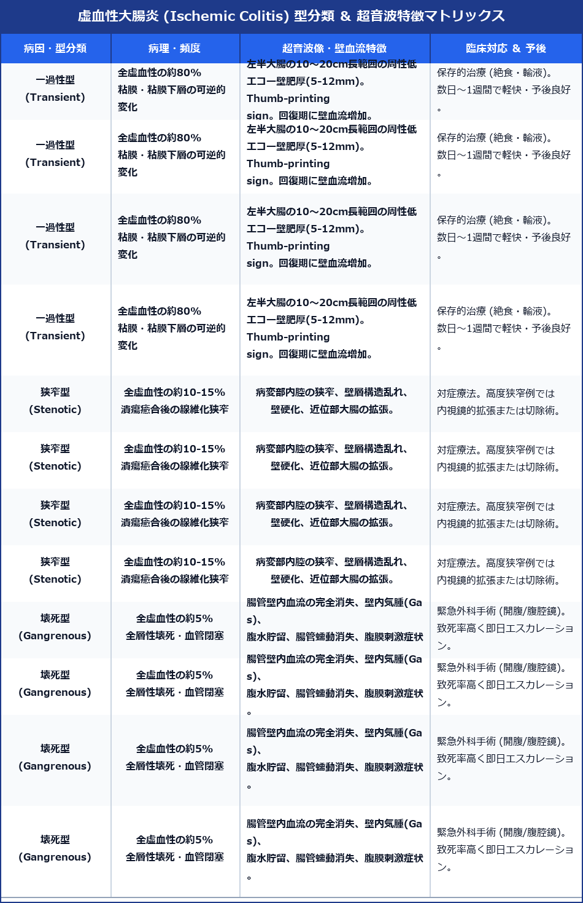

# 虚血性大腸炎 (Ischemic Colitis) 超詳細診断プロトコル

> [!NOTE] 概要
> 虚血性大腸炎は、大腸の微小循環障害（主に下腸間膜動脈 IMA 支配域）に起因する急性全周性大腸炎です。突然の左下腹部痛、下痢・水様便、鮮血便（三主徴）を特徴とし、高齢者、便秘症、動脈硬化患者に好発します。超音波検査は分節性壁肥厚、Thumb-printing sign、壁血流変化の非侵襲的即時判定および壊死型の識別において極めて重要です。

---

## 1. 虚血性大腸炎の型分類 ＆ 超音波特徴判定マトリックス

---

## 2. 4大特徴超音波サイン (Ultrasound Signs)

### 1) 分節性壁肥厚 (Segmental Wall Thickening)
- **好発領域**: 下行結腸 ～ S状結腸（左半大腸）。長さ **10 ～ 20 cm 以上**の連続的・全周性壁肥厚。
- **壁厚値**: **> 5 mm** (著明例では **8 ～ 12 mm**)。全層構造は保たれるが、粘膜下層の浮腫性肥厚が主体。

### 2) Thumb-printing Sign (親指圧痕像)
- **像の特徴**: 粘膜下層の高度な浮腫・出血により、内腔面に向かって親指で押し付けたような結節状・波状の波状凹凸像を呈する。

### 3) カラードプラ壁血流変化 (Color Doppler Signal Dynamics)
- **発症初期・急性期**: 血管攣縮・血流障害により、腸管壁内の血流シグナルが**著明低下 または 消失**。
- **回復期 (発症24-48時間後)**: 虚血後の反応性充血 (Hyperemia) により、肥厚壁内に**豊富な血流シグナルを認める**。

### 4) 腸管周囲脂肪織高エコー化 (Pericolonic Fat Stranding)
- 炎症の波及により、病変腸管の周囲脂肪織が軽度高エコー化。クローン病の Fat wrapping ほど高度ではない。

---

## 3. 壊死型 (Gangrenous Type) の鑑別 ＆ 緊急警告サイン

> [!WARNING] 壊死型を見逃さない！
> 全虚血性の約5%に発生し、全層壊死・穿孔から汎発性腹膜炎に至る。
> - **壁内気腫 (Intramural Gas / Pneumatosis intestinalis)**: 壁内に点状・線状の高エコー（微小気泡）。
> - **門脈内ガス (Portal Venous Gas)**: 門脈内を末梢へ流れる点状高エコー像。
> - **壁血流完全消失**: カラードプラで壁内血流が全く認められない。
> - **腸管蠕動の完全麻痺・消失** ＋ **腹水貯留 (Ascites)**。

---

## 4. 主な鑑別疾患

---

## 5. スキャン手順 (Step-by-Step Protocol)

1. **基本姿勢**: 仰臥位。コンベックス探触子 (3.5 MHz) で左下腹部（S状結腸・下行結腸）を重点観察。
2. **長軸・短軸走査**: S状結腸から下行結腸、左結腸曲（Splenic flexure）まで連続的に追跡。
3. **壁厚 ＆ 層構造計測**: 最も厚い部位で層壁厚を計測（正常 < 3 mm）。
4. **Thumb-printing sign 観察**: リニア探触子 (7.5-12 MHz) に切り替え、内腔面の波状凹凸を詳細観察。
5. **カラードプラ評価**: 壁内血流シグナルの有無（無血流 = 壊死疑い、豊富な血流 = 回復期）。
6. **壊死型サイン検索**: 腹水、壁内気腫、門脈内ガス、蠕動麻痺の有無を確認。

---

## 6. レポート記載例

`
【超音波所見】
左半大腸（下行結腸～S状結腸）：
・全長約 15 cm にわたり全周性の層構造が保たれた連続的壁肥厚（最大壁厚 8.5 mm）を認める。
・粘膜下層の浮腫性肥厚が主体であり、内腔面にThumb-printing signを呈する。
・カラードプラにて肥厚壁内に比較的豊富な血流シグナルを認める（回復期所見）。
・病変部周囲脂肪織の軽度高エコー化を認める。
・腹水貯留なし。壁内気腫・門脈ガス像なし。腸管蠕動は保たれている。

【印象】
下行結腸～S状結腸を中心とする一過性虚血性大腸炎（回復期）。
壊死型・穿孔を示唆する所見なし。
`
