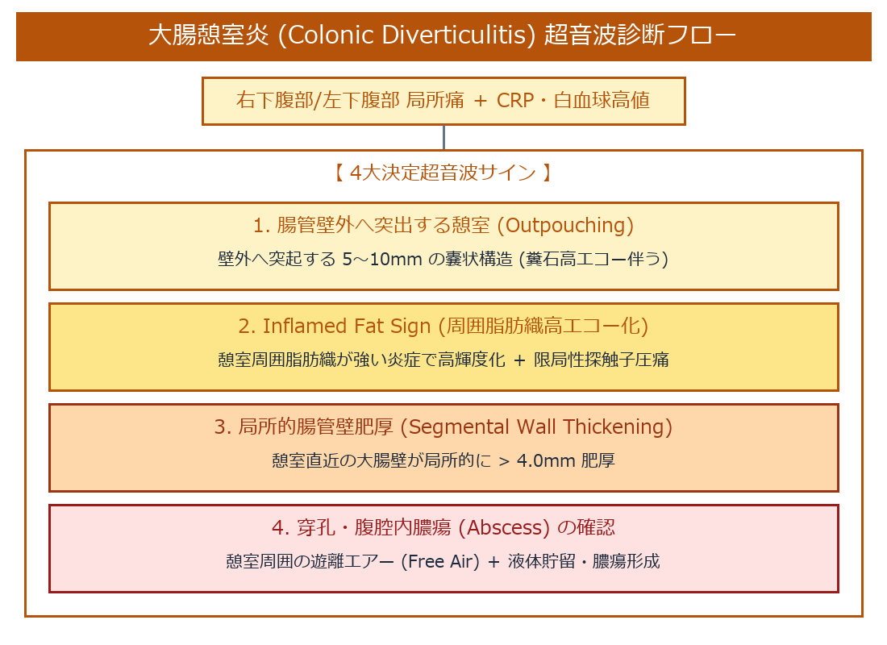

# 大腸憩室炎 (Colonic Diverticulitis) 超詳細診断プロトコル

> [!NOTE] 概要
> 大腸憩室炎は大腸壁の筋層欠損部から突出した憩室内への糞石嵌頓・感染による局所急性炎症。日本人は右半大腸（盲腸・上行結腸）優位だが欧米型食事の普及でS状結腸も増加。急性虫垂炎との鑑別が右側では重要。

---

## 1. 診断フロー



---

## 2. 4大特徴超音波サイン

| サイン | 内容 |
|-------|------|
| **憩室構造（Outpouching）** | 固有筋層外へ突出する径 5〜10 mm の袋状小嚢胞・内部に糞石（高エコー＋陰影）またはガス（ring-down）|
| **Inflamed Fat Sign** | 憩室周囲の脂肪織が**著明高エコー化**（炎症浸潤）・探触子圧迫で局所圧痛 |
| **局所壁肥厚** | 憩室周囲の腸管壁が局所的に > 4.0 mm 肥厚（全周性には及ばない）|
| **カラードプラ充血** | 憩室壁・周囲脂肪織に血流増加シグナル |

---

## 3. 合併症の評価

| 合併症 | 超音波所見 | 緊急度 |
|-------|----------|-------|
| **周囲膿瘍** | 憩室周囲の低〜無エコー液体貯留・壁不整 | 高（ドレナージ）|
| **穿孔** | 遊離ガス（腹腔内高エコー）・腹水 | **最高（緊急手術）**|
| **瘻孔形成** | 腸管間または膀胱への線状低エコー | 中（待機手術）|
| **腸閉塞** | 炎症による腸管狭窄・口側拡張 | 高 |

---

## 4. 右側大腸憩室炎 vs 急性虫垂炎（最重要鑑別）

| | 右側大腸憩室炎 | 急性虫垂炎 |
|--|-------------|---------|
| 位置 | 盲腸〜上行結腸の**壁外突出構造**から | 回盲部の**盲端構造**（虫垂）|
| 構造 | 腸管壁の外方突出（袋状）| 蚯蚓状管腔（盲端）|
| 虫垂 | **正常虫垂が別に描出できる** | 腫大した虫垂が主病変 |
| 糞石 | 憩室内（壁外）| 虫垂内腔 |
| 発熱 | 軽度 | 中等度 |
| 白血球 | 上昇 | 上昇 |

---

## 5. 日本人 vs 欧米人の好発部位

| | 日本人 | 欧米人 |
|--|--------|-------|
| 好発部位 | **右半大腸（盲腸・上行結腸）** | **S状結腸・左半大腸** |
| 憩室の種類 | 真性憩室（先天性）| 仮性憩室（後天性）|
| 若年発症 | 多い | 少ない |

---

## 6. スキャン手順

1. **症状部位をリニアプローブで重点評価**
2. **右側痛**：盲腸〜上行結腸を追い、憩室突出部を探す
3. **左側痛**：S状結腸〜下行結腸を評価
4. **憩室の確認**：腸管壁外への嚢胞状突出
5. **糞石・ガス**：高エコー＋音響陰影 / ring-down artifact
6. **Inflamed fat sign**：周囲脂肪の高エコー化・圧痛
7. **膿瘍・腹水**：合併症の評価
8. **右側では虫垂を描出して正常を確認**

---

## 7. Hinchey分類（穿孔性大腸憩室炎）

| Stage | 所見 | 治療 |
|-------|------|------|
| **I** | 腸間膜膿瘍 | 抗菌薬±経皮ドレナージ |
| **II** | 骨盤膿瘍 | 経皮ドレナージ |
| **III** | 化膿性腹膜炎 | 緊急手術 |
| **IV** | 糞便性腹膜炎 | 緊急手術 |

---

## 8. レポート記載例

```
上行結腸中部：腸管壁外に径 8 mm の嚢胞状突出（憩室）を認める。
内部に高エコー（糞石、音響陰影あり）。
憩室周囲の脂肪織は著明高エコー化（Inflamed fat sign）。探触子圧迫で局所圧痛あり。
腸管壁：憩室周囲に局所的壁肥厚（5 mm）。腹腔内遊離ガス・腹水なし。
虫垂：別途描出、正常（虫垂炎を否定）。
右側大腸憩室炎として矛盾しない。消化器内科コンサルト・CT精査を推奨する。
```
