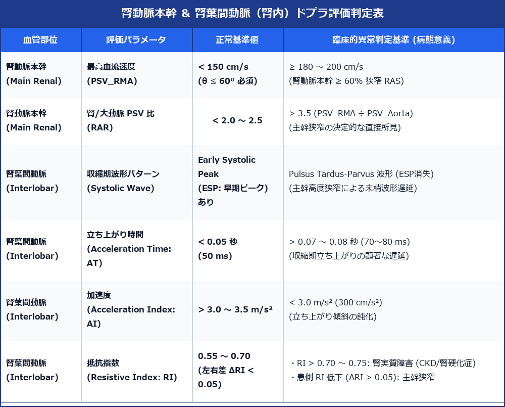

# 腎動脈本幹 ＆ 腎葉間動脈ドプラ (Renal Artery & Interlobar Artery Doppler) 超詳細診断プロトコル

> [!NOTE] 概要
> 腎動脈ドプラ検査は、腎血管性高血圧症 (Renovascular Hypertension) や虚血性腎症 (Ischemic Nephropathy) による慢性腎臓病 (CKD) 進行の主要原因である**腎動脈狭窄 (Renal Artery Stenosis: RAS)** を判定し、同時に**腎葉間動脈（/段間動脈）のパルスドプラ波形**から腎実質障害（腎硬化症・糖尿病性腎症・急性拒絶反応等）を非侵襲的に同時評価する臨床第一選択のドプラ検査プロトコルです。

---

## 1. 腎動脈本幹 ＆ 腎葉間動脈ドプラ評価判定表



---

## 2. 腎動脈本幹 (Main Renal Artery: MRA) の評価手技と判定

### 1) 病態生理と狭窄好発部位
- **動脈硬化性 (Atherosclerotic RAS)**: 全RASの約 85 ～ 90%。50代以上・男性・喫煙者に好発。腎動脈**起始部 ～ 近位 1/3** 領域（大動脈プラークの進展）に発生。
- **線維筋性異形成 (Fibromuscular Dysplasia: FMD)**: 全RASの約 10%。20 ～ 40代・女性に好発。腎動脈**中遠位部 ～ 腎内分枝部** に発生（数珠状狭窄 String-of-beads Sign）。

### 2) 定量的本幹直接所見 (Direct Criteria)
- **最高血流速度 (Peak Systolic Velocity: PSV_RMA)**:
  - 狭窄部 PSV **≥ 180 ～ 200 cm/s** (角度補正 θ ≤ 60° 必須)。
- **腎 / 大動脈 PSV 比 (Renal-Aortic Ratio: RAR)**:
  - 狭窄部 PSV_RMA ÷ 腹部大動脈 PSV_Aorta **> 3.5**。

> [!CAUTION] RAR (腎/大動脈比) 計測の注意点
> 腹部大動脈 PSV (PSV_Aorta) が異常に低い場合（大動脈瘤・心不全で < 40 cm/s）や、逆に高すぎる場合（大動脈縮窄等で > 100 cm/s）は RAR の信頼性が低下するため、**絶対値 PSV > 200 cm/s** を優先して判定する。

---

## 3. 腎葉間動脈 / 段間動脈 (Interlobar / Segmental Artery) の評価手技と判定

腎実質内動脈（段間動脈 Interlobar / 葉間動脈 Arcuate）のパルスドプラ計測は、本幹高度狭窄による**末梢血流遅延**と、腎実質自体の**微小血管抵抗上昇**を直接反映します。

```text
 【正常 腎葉間動脈波形】             【主幹狭窄時: Pulsus Tardus-Parvus】
       /\  ← Early Systolic Peak (ESP)       /---  ← ESP消失・立ち上がり遅延 (Tardus)
      /  \                                  /      ← 振幅低下 (Parvus)
  ___/    \_______                      ___/
     |<AT>| (AT < 50ms)                    |<-- AT -->| (AT > 70-80ms)
```

### 1) 立ち上がり遅延 (Pulsus Tardus-Parvus 波形)
- **Early Systolic Peak (ESP: 早期収縮期ピーク) の消失**:
  - 正常な腎内動脈波形で見られる収縮期最初期の鋭い第1ピーク (ESP) が消失し、波形の頂点が平坦・丸みを帯びる。
- **立ち上がり時間 (Acceleration Time: AT)**:
  - 収縮開始から最高ピーク（またはESP）に至る時間。正常 < 0.05 秒 (50 ms)。**AT > 0.07 ～ 0.08 秒 (70 ～ 80 ms)** で本幹高度狭窄を示唆。
- **加速度 (Acceleration Index: AI)**:
  - 立ち上がり勾配。正常 > 3.0 ～ 3.5 m/s²。**AI < 3.0 m/s² (300 cm/s²)** に低下。

### 2) 抵抗指数 (Resistive Index: RI)
- **計算式**: `RI = (PSV - EDV) / PSV` （EDV: 拡張末期血流速度）
- **正常値**: **0.55 ～ 0.70**（左右差 ΔRI < 0.05）

> [!IMPORTANT] RI の上下変化による解釈の違い
> - **RI 上昇 (> 0.70 ～ 0.75)**: 腎微小血管の抵抗上昇を示す。**腎硬化症、糖尿病性腎症、慢性腎臓病 (CKD)、急性拒絶反応、急性尿路閉塞（水腎症初期）** で上昇。高齢者では加齢により 0.70 前後まで漸増。
> - **RI 低下 ＆ 左右差 (ΔRI > 0.05)**: 患側の本幹高度狭窄により、狭窄末梢の腎内動脈内圧が低下し、**患側の RI が健側に比して低下 (ΔRI > 0.05)** する。

---

## 4. スキャン手順 (Step-by-Step Protocol)

1. **準備・体位**: 8時間以上の絶食。仰臥位および左右側腹部走査。
2. **Step 1: 腹部大動脈 PSV 計測**:
   - 上腹部正中縦断像にて、腎動脈分岐部直上（SMA起始部直下）の腹部大動脈長軸像を描出。
   - ドプラ角度 θ ≤ 60° でサンプルボリュームを置き、**PSV_Aorta** を計測。
3. **Step 2: 左右腎動脈本幹の掃引と直接計測**:
   - 上腹部正中横断像（または Banana-peel view）にて腹部大動脈からの左右腎動脈起始部を描出。
   - 左右の腎動脈を起始部から腎門部まで長軸で追跡。
   - カラードプラを重ね、エイリアシング（モザイクカラー）を呈する最大流速部位を特定。
   - 角度補正 (θ ≤ 60°) を厳密に行い、狭窄部最高流速 **PSV_RMA** を計測。RAR を計算。
4. **Step 3: 腎葉間動脈・段間動脈の間接計測**:
   - 側腹部走査にて左右の腎長軸像を描出。
   - カラードプラを点灯し、腎上極・中極・下極の3領域の**段間動脈/葉間動脈**にサンプルボリューム（1.5～2.0 mm）を配置。
   - スイープ速度を最大に上げて波形を拡大表示し、**ESPの有無**、**立ち上がり時間 (AT)**、**加速度 (AI)**、**RI** を計測。

---

## 5. レポート記載例

```
【超音波所見】
右腎動脈本幹：
・起始部～近位部にてカラードプラ上著明なエイリアシングを認める。
・狭窄部最高血流速度 (PSV_RMA): 245 cm/s（角度補正 52°）
・腹部大動脈 PSV (PSV_Aorta): 58 cm/s
・RAR (腎/大動脈比): 4.22 ( > 3.5)

右腎葉間動脈・段間動脈（腎内ドプラ）：
・収縮期波形は Pulsus tardus-parvus 波形を呈し、Early Systolic Peak (ESP) は消失。
・立ち上がり時間 (AT): 0.092 sec ( > 0.07 sec)
・加速度 (AI): 2.2 m/s² ( < 3.0 m/s²)
・抵抗指数 (RI): 0.50

左腎動脈本幹および左腎葉間動脈：
・左腎動脈本幹 PSV: 115 cm/s、RAR: 1.98（狭窄なし）
・左腎葉間動脈波形: ESP明瞭、AT: 0.038 sec、RI: 0.65 (左右差 ΔRI: 0.15)

腎形態：右腎長径 91 mm（軽度萎縮傾向）、左腎長径 109 mm。

【印象】
右腎動脈本幹高度狭窄（> 60% 狭窄）および右腎葉間動脈における著明な Tardus-parvus 波形（ESP消失・AT遅延・RI低下）を認める。
右動脈硬化性腎動脈狭窄症 (Renal Artery Stenosis) に極めて矛盾しない。
カテーテル治療（PTRAS）または造影CT/MRA精査を推奨。
```
