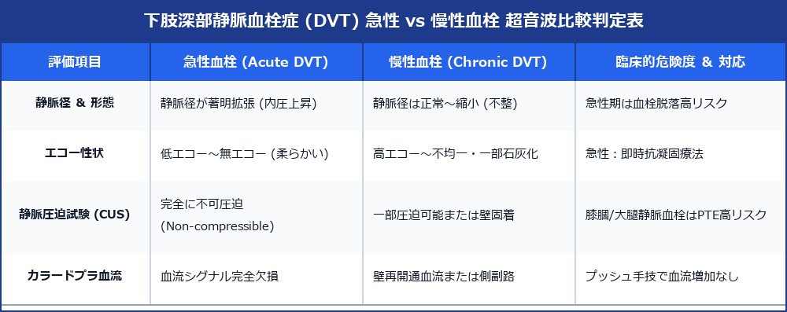

# 下肢深部静脈血栓症 (DVT) ＆ 肺血栓栓塞症 (PTE) 血管超音波評価プロトコル

> [!NOTE] 概要
> 下肢深部静脈血栓症 (DVT) は、下肢の深部静脈内に血栓が形成され、遊離脱落して肺動脈を閉塞する**肺血栓栓塞症 (PTE)** の直接の原因となる危険な病態です。超音波検査は**静脈圧迫手技 (Compression Ultrasound: CUS)** を用いた即時・高感度（感度 > 95%）の第一選択診断法です。

---

## 1. DVT 急性血栓 vs 慢性血栓 超音波判定マトリックス

---

## 2. 2点圧迫法 ＆ 全下肢スキャン手順

### 1) 2点圧迫手技 (2-Point Compression Test)
救急・当直帯で数分で施行可能な標準スクリーニング。
- **部位 1**: 大腿静脈分岐部（総大腿静脈 CFV / 大腿静脈 FV）
- **部位 2**: 膕膝静脈 (Popliteal Vein: PV)
- **手技**: 探触子で静脈を垂直に押し潰す。正常であれば内腔が完全潰破（消失）するが、**血栓存在時は非圧迫 (Non-compressible)** となる。

### 2) ヒラメ筋静脈 (Soleus Vein) スキャン
邦人のDVT発生源として最多のヒラメ筋静脈内血栓（末梢型DVT）を詳細観察。

---

## 3. レポート記載例

`
【超音波所見】
右下肢深部静脈：
・総大腿静脈 (CFV) ～ 膕膝静脈 (PV): 圧迫にて完全に平坦化（血栓なし）。
・右ヒラメ筋静脈: 径 7 mm に拡張し、内部に浮遊性の低エコー血栓を認める。圧迫不能。
・カラードプラ: 血栓末梢側で血流シグナル欠損。

【印象】
右ヒラメ筋静脈深部静脈血栓症 (急性期 DVT)。
PTE 予防のための循環器内科コンサルトおよび抗凝固療法検討を推奨。
`
