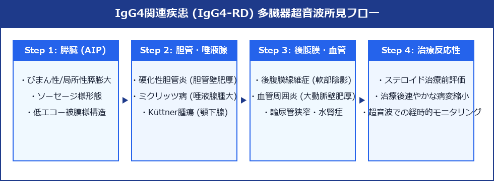

# IgG4関連疾患 (IgG4-related Disease: IgG4-RD) 超詳細診断プロトコル

> [!NOTE] 概要
> IgG4関連疾患 (IgG4-related Disease: IgG4-RD) は、高IgG4血症と組織へのIgG4陽性形質細胞浸潤および特徴的な花ござ状線維化 (Storiform fibrosis)・閉塞性静脈炎 (Obliterative phlebitis) を伴い、全身の単一または複数臓器（膵臓・胆管・唾液腺・腎臓・後腹膜・血管周囲など）にびまん性/局所的な腫大や壁肥厚病変を形成する原因不明の全身性炎症性疾患です。超音波検査は、複数臓器病変の同時スクリーニング、悪性腫瘍（膵がん・胆管がん等）との確実な鑑別、およびステロイド治療の初期効果判定において臨床上主導的な役割を果たします。

---

## 1. 全身臓器における主要超音波像と解剖学的サイン



### 臓器別超音波特徴一覧


---

## 2. 臓器別 超音波診断基準と癌との鑑別詳細

### 1) 自己免疫性膵炎 (AIP Type 1) vs 膵浸潤性管がん (PDAC)
- **AIPの超音波像**:
  - 膵臓全体が滑らかに浮腫状腫大（びまん性型）または局所的腫大（局所型）。
  - 膵小葉構造（微細網目構造）が消失し、均一な低エコー呈する。
  - 膵周囲に厚さ 1 ～ 3 mm の低エコー被膜様帯 (**Capsule-like Rim**) を伴う。
  - **主膵管 (MPD)**: 腫大部を貫く主膵管は狭小化するが、末梢側主膵管の高度拡張（> 3 mm）や断絶を伴わない (**Duct Narrowing Sign**)。
- **膵がんとの決定的な鑑別**:
  - 膵がんは境界不鮮明な低エコー腫瘤で、末梢主膵管の高度拡張（> 3 mm）およびダブルダクトサインを伴い、ステロイドで縮小しない。

### 2) IgG4関連硬化性胆管炎 (IgG4-SC) vs 胆管がん (CCC) / 原発性硬化性胆管炎 (PSC)
- **IgG4-SCの超音波像**:
  - 肝外・肝内胆管壁が全周性に厚く滑らかに肥厚（壁厚 > 2.5 ～ 3.0 mm）。
  - 胆管内腔は全般に狭小化するが、**内腔粘膜面は極めて平滑**で、乳頭状腫瘤や壁の局所的断裂・破壊を認めない。
- **胆管がん / PSC との鑑別**:
  - 胆管がんは壁の偏心性破壊・内腔結節を伴う。PSCは「数珠状拡張（Beaded appearance）」および憩室状突出を伴う。

### 3) IgG4関連腎病変 (IgG4-RKD)
- **超音波像**:
  - 両側腎皮質に散在する多発性の境界比較的明瞭な**低エコー結節 (Multiple hypoechoic nodules)** または **楔状低エコー領域 (Wedge-shaped lesions)**。
  - 腎臓全体のびまん性肥大、および腎盂壁の連続的肥厚。

### 4) IgG4関連後腹膜線維症 (IgG4-RPF) / 血管周囲病変
- **超音波像**:
  - 腹部大動脈 (AAA) および両側総腸骨動脈の周囲を包み込むように存在する、前〜側壁主体の厚い帯状低エコー被覆 (**Periaortic Mantle / Coat-like mass**)。
  - 血管内腔の狭窄は起こしにくいが、走行する両側尿管を内側に巻き込んで包埋し、**二次元的狭窄による水腎症**を来す。

---

## 3. 全身系統的スクリーニング手順 (Step-by-Step Protocol)

1. **Step 1: 膵臓の観察**:
   - 上腹部正中横断・縦断走査にて、膵頭部・体部・尾部の形態（びまん性腫大か局所的か）、小葉構造、周囲 Capsule-like Rim の有無、主膵管径を評価。
2. **Step 2: 胆道系の観察**:
   - 肝門部から総胆管、胆嚢壁、および左右肝内胆管を追跡。胆管壁の厚み、内腔面の平滑性、肝内胆管拡張の有無を確認。
3. **Step 3: 両腎の観察**:
   - 左右の腎長軸・短軸像を描出し、腎皮質内の多発低エコー結節/楔状病変、腎盂壁肥厚、水腎症の有無を確認。
4. **Step 4: 腹部大動脈・後腹膜の観察**:
   - 剣状突起下から大動脈分岐部まで腹部大動脈を連続走査。大動脈周囲の低エコー性 Periaortic Mantle、後腹膜腔の線維性腫瘤、および尿管拡張を確認。
5. **Step 5: 唾液腺（顎下腺）の確認（可能であれば）**:
   - 高周波リニア探触子を用い、左右の顎下腺の腫大・内部不均一低エコー化を評価。

---

## 4. 鑑別診断マトリックス


---

## 5. ステロイド治療に対するレスポンス評価 (Therapeutic Monitoring)

- **著明な治療反応性**:
  - IgG4-RD は副腎皮質ステロイド (Prednisolone) 投与に対する感度が極めて高く、治療開始後のバイオマーカーとして超音波が有効です。
- **経時的超音波所見の変化**:
  - 治療開始 2 ～ 4 週間で、**膵臓のソーセージ様腫大の消退、Capsule-like Rim の消失、胆管壁肥厚の速やかな正常化、腎皮質結節の消退、Periaortic Mantle の縮小**がリアルタイムに捕捉できます。

---

## 6. レポート記載例

```
【超音波所見】
膵臓：
・全体に滑らかなびまん性腫大を認める（体部前後径 26 mm、小葉構造消失）。
・膵周縁に厚さ 2.0 mm の滑らかな低エコー帯 (Capsule-like rim) を伴う。
・主膵管: 体部にて径 1.5 mm と全般に狭小化するが、末梢側主膵管の高度拡張や断絶なし。

胆道系：
・総胆管壁は全周性に滑らかに肥厚（壁厚 3.4 mm、全走行で均一）。内腔面は平滑。
・肝内胆管の軽度拡張あり（右肝管径 3.5 mm）。

両腎：
・右腎皮質に 2 箇所（最大 12 mm）、左腎皮質に 1 箇所（10 mm）の境界比較的明瞭な楔状低エコー領域を認める。
・両側ともに水腎症なし。

腹部大動脈：
・下腎動脈レベルから大動脈分岐部にかけて、大動脈周縁を取り囲む厚さ 5.5 mm の帯状低エコー性被膜 (Periaortic mantle) を認める。

【印象】
膵びまん性腫大 (AIP像)、胆管全周性壁肥厚 (IgG4-SC像)、両腎多発皮質低エコー病変 (IgG4-RKD像)、および大動脈周囲線維化 (IgG4-RPF像) を同時に認める。
多臓器罹患型 IgG4関連疾患 (IgG4-RD) の典型的超音波像。
血清IgG4測定、各臓器生検、および専門医（リウマチ・膠原病科 / 消化器内科）への紹介を推奨。
```
