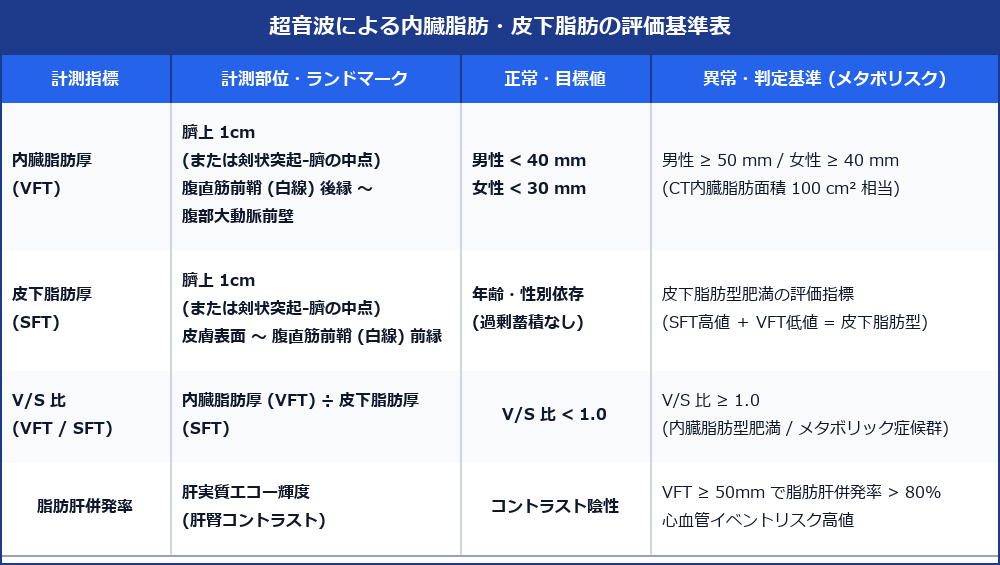

# 内臓脂肪・皮下脂肪 (Visceral & Subcutaneous Fat) 超詳細評価プロトコル

> [!NOTE] 概要
> 超音波による内臓脂肪評価は、CT撮影による被曝を避けつつ、メタボリックシンドロームや生活習慣病（脂肪肝・心血管イベント・2型糖尿病）のリスクを低コストかつ迅速に評価できる高精度な画像診断法です。内臓脂肪厚 (Visceral Fat Thickness: VFT) および皮下脂肪厚 (Subcutaneous Fat Thickness: SFT)、V/S比の標準計測手技と臨床的カットオフ基準を詳細に解説します。

---

## 1. 内臓脂肪・皮下脂肪 超音波評価基準表



---

## 2. 標準計測手技 (Measurement Methodology)

### 1) 計測部位とランドマーク (Anatomical Landmarks)
- **探触子**: コンベックス探触子（3.5 ～ 5.0 MHz）または リニア探触子（7.0 ～ 12.0 MHz）
- **計測ライン**: **臍上 1.0 cm**（または剣状突起と臍を結ぶ線の中点）で腹部正中縦断走査。
- **解剖学的指標**:
  - 腹部大動脈 (Abdominal Aorta) 前壁
  - 腹直筋前鞘 (Anterior Rectus Sheath / 白線 Linea Alba)
  - 皮膚表面

```text
 【皮膚表面】
      │  ← 皮下脂肪厚 (SFT): 皮膚表面 〜 腹直筋前鞘前縁
 【腹直筋前鞘 (白線)】
      │  
 【腹直筋後鞘 / 腹膜】
      │  ← 内臓脂肪厚 (VFT): 腹直筋前鞘後縁 〜 腹部大動脈前壁
 【腹部大動脈前壁】
```

### 2) 計測時の重要ピットフォールと注意点
> [!IMPORTANT] プローブ圧迫による測定誤差の回避
> - **非圧迫状態 (Non-compression)**: 探触子を腹壁に強く押し当てると、皮下脂肪および内臓脂肪が圧縮されて厚みが偽性に減少する。皮膚にジェルをたっぷり盛り、**探触子の自重のみで接触させる**。
> - **呼吸位相の指定**: 呼気末（息を軽く吐ききった状態）で静止させて計測する。吸気時には横隔膜降下により腹腔内圧が上昇し、VFTが変化する。

---

## 3. 臨床的意義と関連病態

### 1) 内臓脂肪型肥満とメタボリックシンドローム
- **VFT ≥ 50 mm (男性) / ≥ 40 mm (女性)**:
  - CT画像における**内臓脂肪面積 (VFA) ≥ 100 cm²** に極めて高く相関 (r = 0.75 ～ 0.85)。
- **V/S 比 (VFT / SFT Ratio) ≥ 1.0**:
  - 皮下脂肪に対する内臓脂肪の相対的過剰蓄積を示し、**内臓脂肪型肥満**の確定診断指標となる。

### 2) 脂肪肝 (MASLD/NAFLD) および動脈硬化との相関
- 内臓脂肪組織から遊離脂肪酸 (FFA) や悪性アディポサイトカイン (TNF-α, IL-6, レジスチン) が門脈を介して直接肝臓へ流入。
- VFT ≥ 50 mm の症例では、**脂肪肝 (MASLD) 併発率が 80% 超**、心血管イベント (MACE) やインスリン抵抗性リスクが有意に上昇する。

---

## 4. スキャン手順 (Step-by-Step Protocol)

1. **基本体位**: 被検者を仰臥位とし、両手を体側に自然に置かせる（腹壁を緊張させない）。
2. **プローブ設置**: 臍上 1 cm の腹部正中線上にコンベックス探触子を垂直に軽く当てる。
3. **ランドマークの確認**: Bモードにて腹直筋前鞘（白線）およびその深部の腹部大動脈前壁を同時画面内に描出。
4. **皮下脂肪厚 (SFT) の計測**: 皮膚表面から腹直筋前鞘前縁までの垂直距離を計測。
5. **内臓脂肪厚 (VFT) の計測**: 腹直筋前鞘後縁から腹部大動脈前壁までの垂直距離を計測。
6. **V/S比の算出**: VFT ÷ SFT を計算。

---

## 5. 鑑別診断・評価パターン


---

## 6. レポート記載例

```
【超音波所見】
内臓脂肪・皮下脂肪評価 (臍上1cm 正中走査・非圧迫下):
・内臓脂肪厚 (Visceral Fat Thickness: VFT): 56 mm（正常男性 < 40 mm, メタボ基準 ≥ 50 mm）
・皮下脂肪厚 (Subcutaneous Fat Thickness: SFT): 18 mm
・V/S 比 (VFT / SFT Ratio): 3.11（基準 < 1.0）

肝臓: 実質輝度の全般性上昇、肝腎コントラスト陽性、深部減衰あり（中等度脂肪肝 MASLD）。

【印象】
著明な内臓脂肪蓄積（VFT 56 mm, V/S比 3.11）および中等度脂肪肝を認める。
内臓脂肪型肥満としてメタボリックシンドローム・心血管イベント高リスク群に分類される。
生活習慣改善・栄養指導および定期フォローを推奨する。
```
