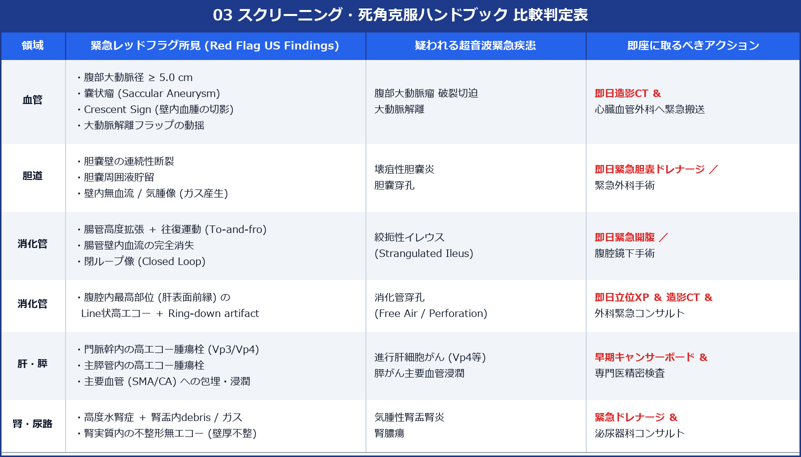

# 腹部スクリーニング・死角克服 ＆ 見逃しゼロ完全ハンドブック

> [!NOTE] 概要
> 腹部超音波スクリーニング検査（健診・ドック・救急）において、癌や重症疾患の「見逃し (Overlook)」を絶対ゼロにするための完全ガイドです。死角になりやすい8大難描出部位の攻略手技、直ちに専門医へエスカレーションすべき緊急レッドフラグ (Red Flags)、および日本超音波医学会 (JSUM) 標準様式に則った所見報告書のプロ記載例を解説します。

---

## 1. 超音波スクリーニング 8大死角部位 (Blind Spots) と克服アプローチ

> [!IMPORTANT] 要点・チェックポイント
> │ 1. 肝右葉頂部 (S8横隔膜直下): 超音波ビームの減衰・屈折
> │ 2. 肝左葉外側区最外側 (S2端): 胃内ガスによる遮蔽
> │ 3. 胆嚢頸部 (GB Neck): 胆嚢管の折れ曲がり・十二指腸ガス
> │ 4. 総胆管下部 (Lower CBD): 膵頭部後ろ・十二指腸ガス
> │ 5. 膵尾部 (Pancreatic Tail): 胃体部・結腸ガス遮蔽
> │ 6. 腎上極 (Kidney Upper Pole): 肺底・横隔膜による遮蔽
> │ 7. 盲腸末端・虫垂根部 (Appendix Root): 骨盤深部・小腸ガス
> │ 8. 腹部大動脈分岐部 (Aortic Bifurcation): 臍周囲ガス

### 1) 肝右葉頂部 (S8ドーム下) の死角克服
- **問題点**: 肋骨および横隔膜直下であり、肺内の空気でビームが遮断され癌の見逃しが最も多い。
- **克服テクニック**:
  - **最大深吸気保持 (Deep Inspiration & Hold)**: 呼吸で肝臓を頭側から尾側へ押し下げさせる。
  - **右高位肋間走査 (High Intercostal Scan)**: 探触子を胸側に1〜2肋間上げ、頭側へあおり（Tilt Up）角をつける。
  - **左側臥位 (Left Lateral Decubitus)**: 重力で肝臓を正中側へ落とし、肋骨隙間を広げる。

### 2) 膵尾部 (Pancreatic Tail) の死角克服
- **問題点**: 胃内ガスおよび胃大網の遮蔽により、膵尾部がんの見逃し率が高い。
- **克服テクニック**:
  - **飲水法 (Water Filling Method)**: 脱泡水（緑茶や水 200〜300ml）を飲用させ、満水となった胃を「音響窓 (Acoustic Window)」として後方の膵尾部を観察。
  - **座位・立位走査 (Sitting Position)**: 体位変更により胃内ガスを頭側へ浮上させ、膵尾部を描出。

### 3) 胆嚢頸部 (GB Neck) 嵌頓結石の死角克服
- **問題点**: 胆嚢頸部は深部に折れ曲がっており、十二指腸ガスと重なって結石が見落とされやすい。
- **克服テクニック**:
  - **右膝屈曲・左側臥位 ＋ 体位変換ダイナミクス**: 体位を変えることで、頸部に引っかかっていた結石が体部・底部へ移動するか動態観察する。

---

## 2. 緊急エスカレーション！絶対見逃し厳禁のレッドフラグ (Red Flags)

以下の超音波所見を検知した場合、スクリーニングレベルにとどめず**「即日精密検査・緊急外科対診」**のアクションを起こす。



---

## 3. 日本超音波医学会 (JSUM) 標準 超音波報告書 (Ultrasound Report) 記載例

臨床でそのまま使えるプロフェッショナルな所見記述テンプレートです。

### 記載例 1：脂肪肝 ＋ 胆嚢ポリープ（スクリーニング健診）
```text
【検査種別】腹部超音波スクリーニング検査
【描出感度】良好 (右肋下・肋間・正中・斜断)

【所見】
1. 肝臓: 実質エコー輝度の全般性上昇を認め、肝腎コントラスト明確に陽性。
   肝深部および横隔膜エコーの軽度減衰を伴う。占拠性病変(Space Occupying Lesion)なし。
   -> 中等度脂肪肝 (Moderate Fatty Liver / MASLD, Grade 2相当)
2. 胆道: 胆嚢体部前壁に径 4.5 mm の強高エコー結節を認め、後方陰影を伴わない。
   体位変化による移動性なし。胆嚢壁肥厚なし(前壁 2.1mm)、総胆管拡張なし(CBD 4.2mm)。
   -> 胆嚢コレステロールポリープ (Cholesterol Polyp, 良性所見)
3. 膵臓・腎臓・脾臓・血管: 特記事項なし。主膵管拡張なし(MPD 1.5mm)。

【判定・方針】
Category 2 (軽度異常・経過観察)。脂肪肝に対し生活習慣改善指導。胆嚢ポリープは1年後に超音波再検。
```

### 記載例 2：膵頭部がん疑い（要精査・Red Flag）
```text
【検査種別】腹部超音波精査 (黄疸・上腹部痛)
【描出感度】中等度 (胃内ガスあり、飲水法併用)

【所見】
1. 膵臓: 膵頭部に径 24 x 18 mm の境界不鮮明な不整型低エコー腫瘤を認める。
   同病変より尾側の主膵管は 4.8 mm と高度拡張し(Double Duct Sign陽性)、総胆管は 11.2 mm と拡張。
   カラードプラにて腫瘤内部の血流信号は著減(Hypovascular)。
2. 胆道: 胆嚢は 85 x 42 mm と高度腫大(Courvoisier徴候陽性)。壁肥厚なし。

【判定・方針】
通常型膵頭部がん (PDAC) の疑い。即日造影EUS ＆ 造影マルチスライスCTによる精密検査を強く推奨。
```

---

## 🔗 関連リンク
- [[00_MOC_目次|MOC目次へ戻る]]
- [[04_実践スクリーニング・計測/超音波標準計測手技マニュアル|JSUM標準計測手技マニュアル]]
- [[04_実践スクリーニング・計測/腹部超音波標準計測値一覧|腹部超音波標準計測値・臨床カットオフバイブル]]
