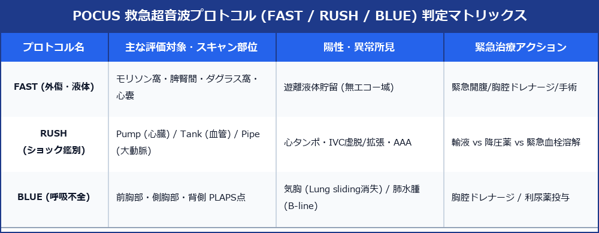

# POCUS 救急超音波プロトコル (FAST / RUSH / BLUE) バイブル

> [!NOTE] 概要
> POCUS (Point-of-Care Ultrasound) は、救急室、集中治療室 (ICU)、当直帯、ベッドサイドにおいて、臨床医・検査技師が即座に病態を特定し命を救うための目的限定的超音波プロトコルです。代表的な **FAST (外傷外液)**、**RUSH (ショック鑑別)**、**BLUE (呼吸不全)** の3大プロトコルを網羅します。

---

## 1. POCUS 3大救急プロトコル判定マトリックス

---

## 2. 各プロトコルの詳細手技

### 1) FAST (Trauma Fluid Assessment)
外傷患者における腹腔内・胸腔内・心嚢内の活動性出血（無エコー域）を2分以内に同定。
- **① モリソン窩 (Morison's Pouch)**: 右肝腎間隙
- **② 脾腎間隙 (Splenorenal Recess)**: 左横隔膜下
- **③ 骨盤腔 (ダグラス窩 / 直腸膀胱窩)**
- **④ 心嚢腔 (Subxiphoid)**: 心タンポナーデ確認

### 2) RUSH (Rapid Ultrasound for Shock & Hypotension)
ショック病態（出血性 vs 心原性 vs 敗血症性 vs 閉塞性）の鑑別。
- **Pump (心臓)**: EF低下？ 心タンポ？ 右心拡大 (PE疑い)？
- **Tank (血管内ボリューム)**: IVC 虚脱 (出血/脱水) vs IVC 拡大固定 (心不全/PE)
- **Pipe (大幹血管)**: 腹部大動脈瘤 (AAA) 破裂？ 大動脈解離？

### 3) BLUE (Bedside Lung Ultrasound in Emergency)
急性呼吸不全の数分鑑別。
- **Lung Sliding (肺滑走像)**: 存在 (正常/肺炎) vs 消失 (気胸疑い)
- **B-line (水泡像)**: 群発 (>3本) → 肺水腫 / 心不全
- **PLAPS (胸膜下病変)**: 胸水・肺コンソリデーション（肺炎/肺梗塞）

---

## 3. レポート記載例

`
【POCUS 所見】
RUSH プロトコル施行：
・Pump: EF 55% 推定、心嚢水なし。右室拡大なし。
・Tank: モリソン窩およびダグラス窩に少量～中等量の無エコー域（腹水/出血）を認める。IVC 径 8 mm (呼気時虚血著明)。
・Pipe: 腹部大動脈径 18 mm (拡大なし)。

【印象】
腹腔内出血/遊離液体貯留を伴う低容量性ショック (Hypovolemic Shock)。
`
