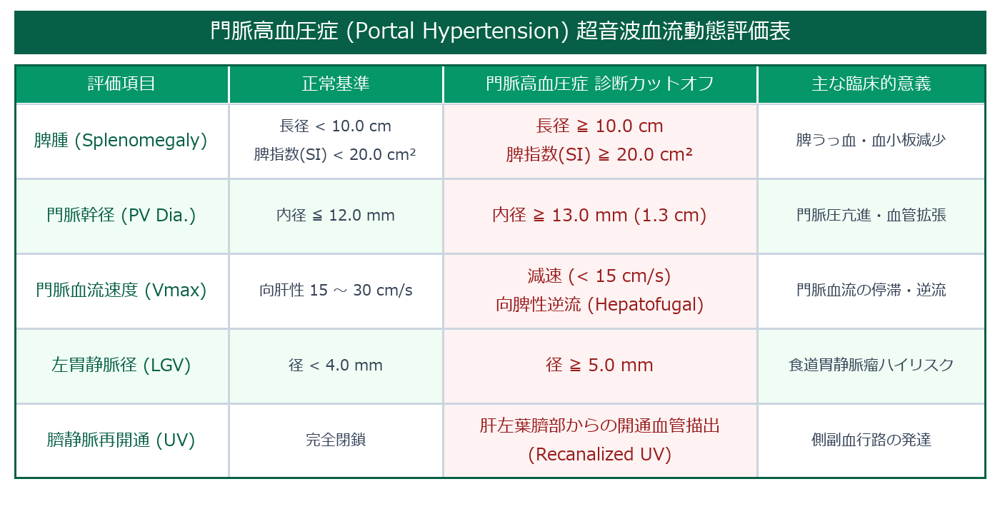

# 肝硬変 (Liver Cirrhosis: LC) 超詳細診断プロトコル

> [!NOTE] 概要
> 肝硬変は持続する肝細胞障害と再生成・線維化により、肝構造改築、実質粗雑化、門脈高血圧症を呈する終末期病態です。本プロトコルでは、Bモードでの肝形態変化（C/RL比など）、門脈高血圧症に伴う血流動態変化（向脾性血流や側副血行路）、HV波形分類、および剪断波エラストグラフィ (SWE) による線維化ステージ判定を網羅して解説します。

---

## 1. 肝形態・表面の微細解剖評価

- **尾状葉/右葉比 (C/RL Ratio)**: 
  - 上腹部正中横断像で下大静脈直前の尾状葉横径(C)と右葉横径(RL)を計測。**$\text{C/RL} > 0.65$** で特異度 > 90% の肝硬変指標。
- **肝被膜表面の凹凸 (Nodularity)**:
  - 高周波リニア探触子（7.5〜12MHz）を肝表面（左葉前縁または右葉表面）に当て、被膜の結節状凹凸（Nodular surface）を判定。

---

## 2. 門脈高血圧症 (Portal Hypertension) の血流動態評価

---

## 3. 肝静脈波形分類 (Hepatic Vein Waveform)

- **HV-0 (Triphasic)**: 正常3相波形（右心房の心周期に応じた拍動性）。
- **HV-1 (Biphasic)**: a波消失、2相性。
- **HV-2 (Monophasic)**: 拍動性完全消失・平坦化 (Flat Pattern)。肝線維化による肝静脈コンプライアンス低下を反映。

---

## 🔗 関連リンク
- [[00_MOC_目次|MOC目次へ戻る]]
- [[03_疾患別超音波所見/01_肝臓_脂肪肝|脂肪肝]]
- [[03_疾患別超音波所見/03_肝臓_肝細胞がん|肝細胞がん]]