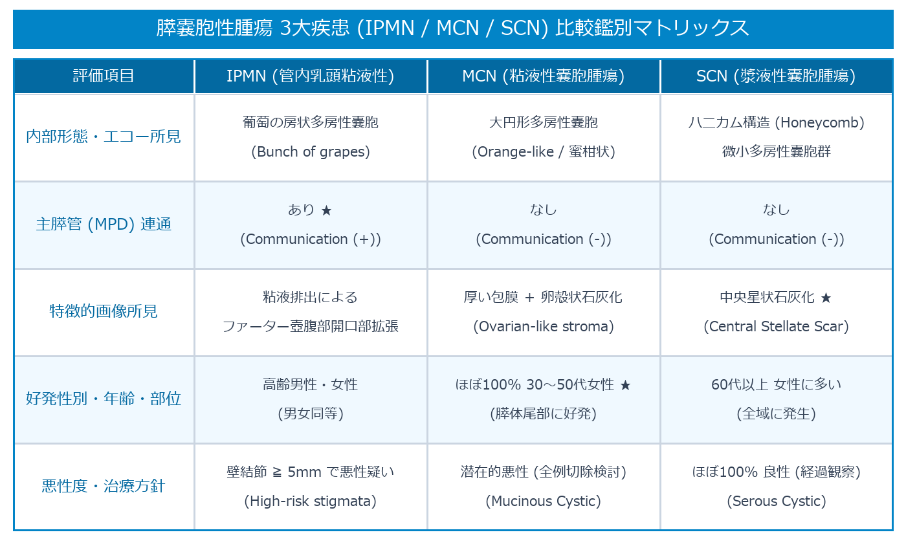

# 膵嚢胞性腫瘍 (IPMN / MCN / SCN) 超詳細判定プロトコル

> [!NOTE] 概要
> 膵嚢胞性腫瘍は、**IPMN (膵管内乳頭粘液性腫瘍)**、**MCN (粘液性嚢胞腫瘍)**、**SCN (漿液性嚢胞腫瘍)** の3大病態に大別されます。本プロトコルでは、Bモードでの内部形態（ぶどうの房状 vs 蜜柑状 vs ハニカム構造）、主膵管連通の有無、および国際ガイドライン（Fukuoka/Kyoto Criteria）に基づく悪性度判定基準を網羅して解説します。

---

## 1. 膵嚢胞性腫瘍 3大病態の比較鑑別マトリックス

---

## 2. IPMN の臨床ガイドライン分類 (Fukuoka Criteria 準拠)

### 1) High-risk stigmata (ハイリスク所見: 即座に外科切除を考慮)
- **黄疸** (閉塞性黄疸)
- **主膵管径 ≧ 10 mm**
- **造影壁内結節 ≧ 5 mm** (Sonazoid CEUS または EUS で確認)

### 2) Worrisome features (要警戒所見: EUS 精査および厳重フォロー)
- **嚢胞径 ≧ 3 cm**
- **主膵管径 5 ～ 9 mm**
- **壁厚増加・造影結節 < 5 mm**
- **CA19-9 上昇**
- **嚢胞増大速度 > 5 mm / 2年**

---

## 🔗 関連リンク
- [[00_MOC_目次|MOC目次へ戻る]]
- [[03_疾患別超音波所見/09_膵臓_膵腫瘤性病変_固形および嚢胞性分類|膵腫瘤性病変 完全判定プロトコル]]
- [[03_疾患別超音波所見/10_膵臓_膵がん|膵がん (PDAC)]]
- [[03_疾患別超音波所見/12_膵臓_急性・慢性膵炎|急性・慢性膵炎]]