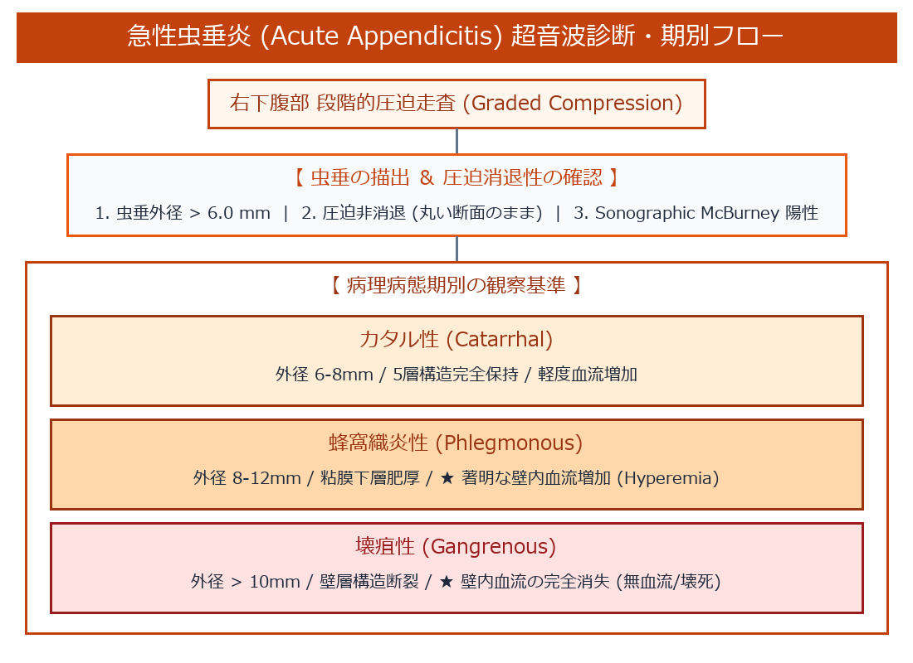

# 急性虫垂炎 (Acute Appendicitis) 超詳細診断プロトコル

> [!NOTE] 概要
> 急性虫垂炎は小児から高齢者まで幅広く発症する代表的な緊急疾患です。高周波リニア探触子による**段階的圧迫技法 (Graded Compression Technique)**、虫垂径・層構造・周囲脂肪輝度、およびカラードプラ血流変化による詳細な病理期別評価を解説します。

---

## 1. 急性虫垂炎 診断 ＆ 病理期別判定アルゴリズム

---

## 2. 段階的圧迫技法 (Graded Compression Technique)

- **手技**: 痛みの強い右下腹部（McBurney点 / Lance点近傍）に高周波リニアプローブを垂直に当て、消化管ガスを側方へ押し除けるように徐々に一定の圧迫を加える。
- **正常消化管 vs 虫垂炎**:
  - 正常な小腸・大腸: 圧迫により簡単に扁平化（潰れる）。
  - **炎症性虫垂**: 内腔内圧の上昇と壁浮腫のため、**いくら圧迫しても丸い断面が潰れない (Non-compressible Round Structure)**。

---

## 3. 病理病態期別 超音波所見分類 (Pathological Staging)

![[auto_table_14_消化管_急性虫垂炎_1.png]]
> [!IMPORTANT] 壊疽性における血流消失のピットフォール
> 蜂窩織炎性では血流信号が極めて強くなりますが、壊疽性に進行して壁微小血管が血栓閉塞・壊死を起こすと**カラードプラ血流信号が消失**します。「血流がないから正常」と誤診せず、層構造の消失と壁の不整から壊疽性を判断する。

---

## 🔗 関連リンク
- [[00_MOC_目次|MOC目次へ戻る]]
- [[02_臓器別解剖と標準描出/消化管_解剖と描出法|消化管：層構造と標準描出]]
- [[04_実践スクリーニング・計測/腹部超音波計測値一覧|腹部超音波標準計測値一覧]]