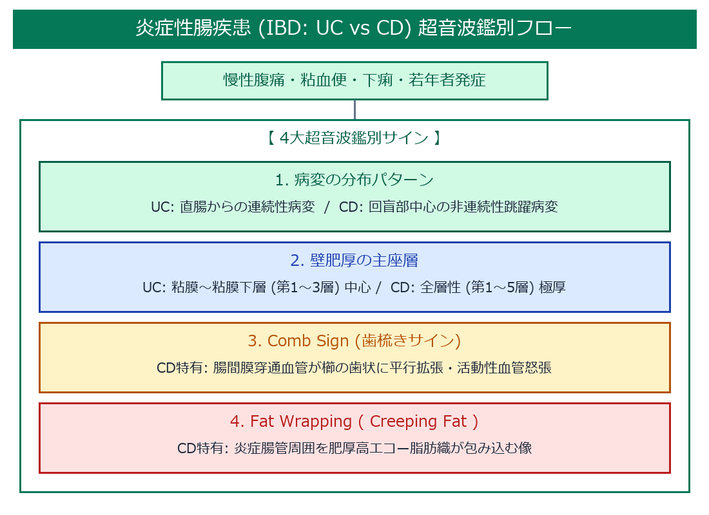
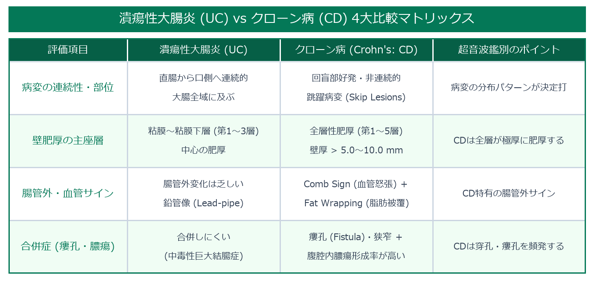

# 炎症性腸疾患 (IBD: 潰瘍性大腸炎 vs クローン病) 超詳細鑑別プロトコル

> [!NOTE] 概要
> 炎症性腸疾患 (Inflammatory Bowel Disease: IBD) の超音波評価では、**潰瘍性大腸炎 (UC)** と **クローン病 (Crohn's Disease: CD)** の病変の分布パターン（連続性 vs 非連続性）、壁肥厚の主層（粘膜下層中心 vs 全層性）、および腸管外所見（Comb sign・Fat wrapping）を明確に鑑別します。

---

## 1. IBD 鑑別超音波フローチャート

---

## 2. 潰瘍性大腸炎 (UC) vs クローン病 (CD) 4大比較マトリックス

---

## 3. 潰瘍性大腸炎 (Ulcerative Colitis: UC) の特徴的エコーサイン

1. **直腸からの連続性壁肥厚 (Continuous Involvement)**:
   - 病変が直腸・S状結腸から口側大腸へ途切れなく連続的に広がる。
2. **粘膜下層中心の層肥厚 (Submucosal Thickening)**:
   - 肥厚の主体は第3層（粘膜下層）であり、第4層（固有筋層）は保たれる。
3. **鉛管像 (Lead-pipe Appearance)**:
   - 慢性期・重症期において、大腸ハウストラ（腸嚢）が完全に消失し、管状に平坦化した壁が描出される。

---

## 4. クローン病 (Crohn's Disease: CD) の特徴的エコーサイン

1. **跳躍病変 ＆ 回盲部全層性肥厚 (Skip Lesions & Transmural Thickening)**:
   - 回腸末端（回盲部）に好発し、正常腸管と病変腸管が交互に存在する非連続的跳躍病変。第1〜5層の全層が極厚（> 5〜10mm）に肥厚。
2. **Comb Sign (歯梳きサイン / 腸間膜血管怒張)**:
   - カラードプラにて、炎症した腸管壁に向かって走行する腸間膜穿通血管が櫛の歯（Comb）のように平行に拡張・怒張して描出される活動性サイン。
3. **Fat Wrapping ( Creeping Fat / 脂肪被覆)**:
   - 炎症腸管の周囲を、高エコー化した肥厚腸間膜脂肪織が全周性に包み込む像。
4. **瘻孔 (Fistula) ＆ 膿瘍 (Abscess)**:
   - 腸管―腸管間、または腸管―皮膚間に通ずる線状の低/無エコー性の瘻孔ルートおよび周囲膿瘍形成。

---

## 🔗 関連リンク
- [[00_MOC_目次|MOC目次へ戻る]]
- [[03_疾患別超音波所見/22_消化管_大腸がん・大腸ポリープ|大腸がん・大腸ポリープ]]
- [[03_疾患別超音波所見/25_消化管_虚血性大腸炎|虚血性大腸炎]]
