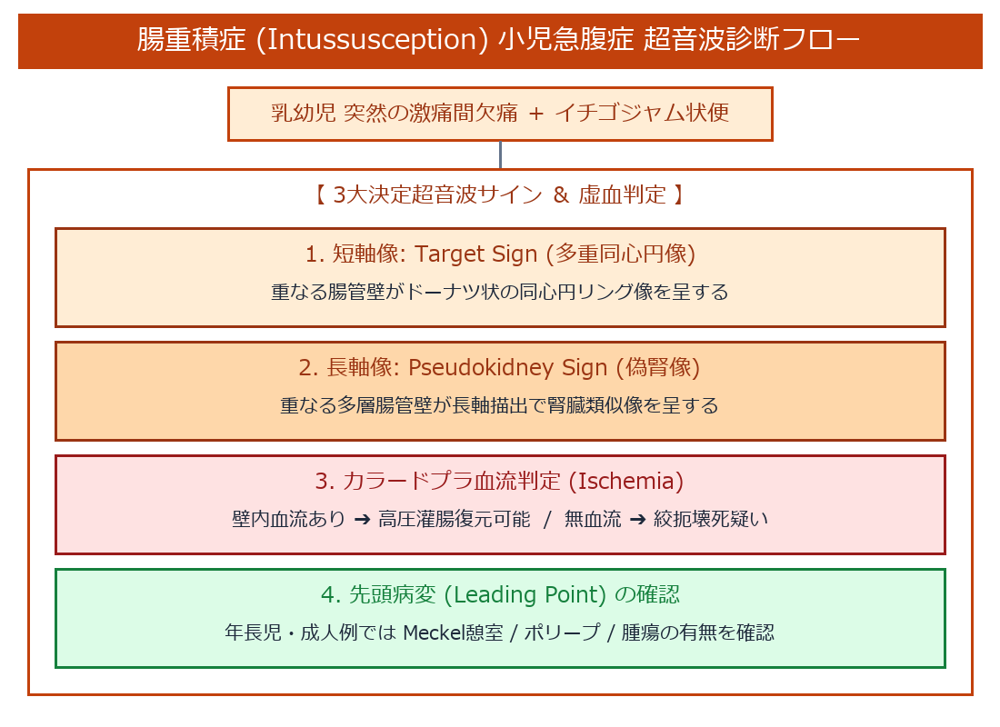

# 腸重積症 (Intussusception) 超詳細小児急腹症プロトコル

> [!NOTE] 概要
> 腸重積症は、口側の腸管（重入腸管: Intussusceptum）が尾側の腸管（受入腸管: Intussuscipiens）にはまり込み、重なることで絞扼・循環障害を来す乳幼児・小児急腹症（回腸―盲腸型が90%）です。

---

## 1. 腸重積症 超音波診断 ＆ 虚血評価フロー

---

## 2. 腸重積症 3大決定超音波サイン

1. **Target Sign / Multiple Concentric Ring Sign (多重同心円像)**:
   - 探触子を重積部に垂直（短軸像）に当てると、重なる腸管壁層と外入腸管・内入腸管が交互に同心円状のリング構造（ドーナツ像）として観察される。
2. **Pseudokidney Sign (長軸像での偽腎像)**:
   - 重積部の長軸描出において、重なった多層腸管壁が腎臓の皮質・髄質構造に類似した曲状多層像を呈する。
3. **カラードプラによる虚血・腸管生存能評価 (Ischemia Evaluation)**:
   - 重積腸管壁内にカラードプラで血流信号が確認されれば高圧灌腸（非手術的復元）可能。血流信号が完全消失している場合は絞扼壊死疑いとして緊急手術を考慮する。

---

## 🔗 関連リンク
- [[00_MOC_目次|MOC目次へ戻る]]
- [[03_疾患別超音波所見/14_消化管_急性虫垂炎|急性虫垂炎]]
- [[03_疾患別超音波所見/15_消化管_腸閉塞・イレウス|腸閉塞・イレウス]]
