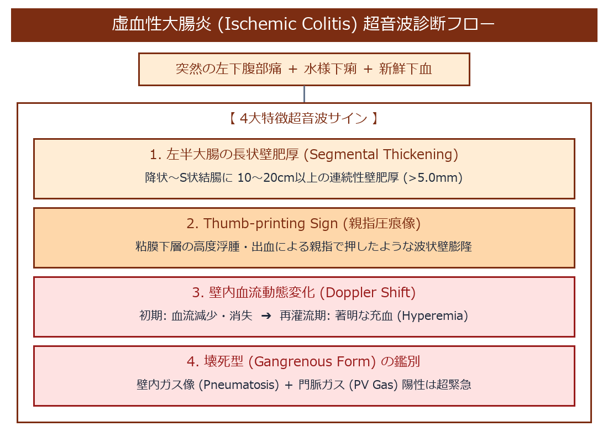

# 虚血性大腸炎 (Ischemic Colitis) 超詳細診断プロトコル

> [!NOTE] 概要
> 虚血性大腸炎は、大腸壁の微小血管網（特に下腸間膜動脈領域である降状結腸〜S状結腸）の急性微小循環障害により、突然の左下腹部痛・水様便・下血を来す疾患です。

---

## 1. 虚血性大腸炎 超音波診断フローチャート

---

## 2. 虚血性大腸炎 4大特徴超音波サイン

1. **左半大腸の長状・連続性壁肥厚 (Segmental Thickening)**:
   - 降状結腸からS状結腸（左下腹部）にかけて、**長さ 10 ～ 20 cm 以上**の比較的長い連続的な全周性低エコー壁肥厚 (**> 5.0 mm**, 著明例では 8〜12mm) を認める。
2. **Thumb-printing Sign (親指圧痕像)**:
   - 粘膜下層の高度な浮腫・粘膜下出血により、内腔に向かって親指で押し当てたような波状の凹凸壁膨隆を呈する。
3. **カラードプラ壁血流動態変化 (Doppler Shift)**:
   - **急性期・虚血初期**: 壁内血流信号が減少・消失。
   - **再灌流期・回復期**: 一転して壁内に著明な充血・血流増加信号 (Hyperemia) を認める。
4. **周囲脂肪織の軽度高エコー化**:
   - 炎症・浮腫に反応して腸管周囲の脂肪織が軽度高エコー化するが、クローン病のような著明な Fat wrapping は伴わない。

---

## 🔗 関連リンク
- [[00_MOC_目次|MOC目次へ戻る]]
- [[03_疾患別超音波所見/22_消化管_大腸がん・大腸ポリープ|大腸がん・大腸ポリープ]]
- [[03_疾患別超音波所見/23_消化管_炎症性腸疾患_IBD_潰瘍性大腸炎_クローン病|炎症性腸疾患 (IBD)]]
