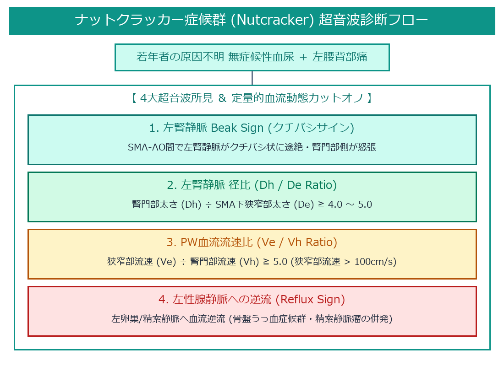
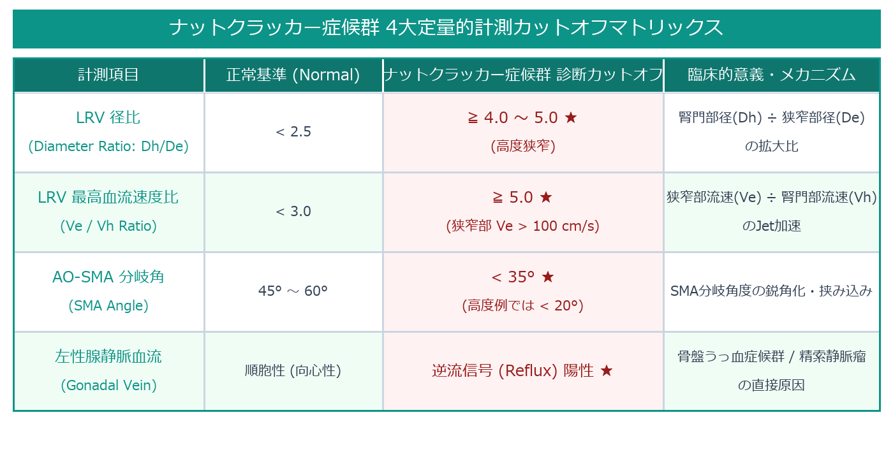

# ナットクラッカー症候群 (Nutcracker Syndrome / 左腎静脈圧迫症候群) 超詳細診断プロトコル

> [!NOTE] 概要
> ナットクラッカー症候群 (Nutcracker Phenomenon / Syndrome) は、**上腸間膜動脈 (SMA)** と **腹部大動脈 (AO)** のなす解剖学的挟み込み構造（前ナットクラッカー）または腹部大動脈と脊椎の間（後ナットクラッカー）において、**左腎静脈 (Left Renal Vein: LRV)** が胡桃割りのように機械的に圧迫・狭窄される病態です。左腎静脈圧の上昇により、原因不明の無症候性血尿、左腰背部痛、および左性腺静脈への逆流（精索静脈瘤・骨盤うっ血症候群）を来します。

---

## 1. 超音波診断 ＆ 血流動態フローチャート

---

## 2. 4大定量的計測カットオフマトリックス

---

## 3. 超音波の 4大特徴的サイン (Sonographic Signs)

1. **Beak Sign (クチバシサイン)**:
   - Bモード正中横断像において、SMAとAOの交差部で左腎静脈が三角形のクチバシ状に押し潰され、腎門部側が球状に怒張・拡張する典型像。
2. **Color Jet Sign (カラー・ジェットサイン)**:
   - 狭窄部（SMA直下）を血流が通過する際、圧力が急激に高まることでカラードプラにて**エイリアシング (Aliasing) を伴う高速ジェット血流**が観察される。
3. **左性腺静脈・側副血行路の逆流 (Collateral Reflux)**:
   - 左腎静脈高圧症に伴い、左腎静脈から尾側へ分岐する**左卵巣静脈（女性）/ 左精索静脈（男性）**へ血液が逆流。女性では骨盤内静脈叢の怒張（骨盤うっ血症候群）、男性では左精索静脈瘤を形成する。
4. **立位負荷・体位変化による増強 (Erect Dynamic Changes)**:
   - 仰臥位から立位をとらせると、内臓下垂によりSMAの分岐角がさらに鋭角化し、左腎静脈の狭窄とJet流速が著明に増強する。

---

## 4. 前ナットクラッカー vs 後ナットクラッカーの解剖学的鑑別

- **前ナットクラッカー (Anterior Nutcracker Syndrome)**:
  - 頻度: **> 95%**（圧倒的多数）。
  - 解剖: LRVが AO と SMA の間（腹側）を通過して下大静脈 (IVC) へ流入。
- **後ナットクラッカー (Posterior Nutcracker Syndrome)**:
  - 頻度: **< 5%**（稀な血管走行変異）。
  - 解剖: LRVが **腹部大動脈 (AO) の背側（AOと第3腰椎の間）** を通過してIVCへ流入。大動脈と脊椎に挟まれて圧迫される。

---

## 🔗 関連リンク
- [[00_MOC_目次|MOC目次へ戻る]]
- [[03_疾患別超音波所見/18_血管_正中弓状靭帯圧迫症候群_MALS|MALS (腹腔動脈圧迫)]]
- [[03_疾患別超音波所見/19_血管_SMA症候群|上腸間膜動脈症候群 (SMA症候群 / Wilkie)]]
- [[03_疾患別超音波所見/13_腎臓_水腎症|水腎症]]