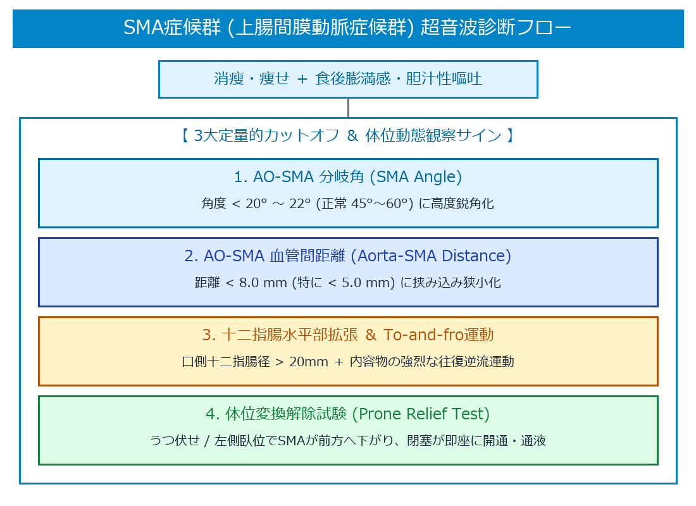

# 上腸間膜動脈症候群 (SMA Syndrome / Wilkie症候群) 超詳細診断プロトコル

> [!NOTE] 概要
> 上腸間膜動脈症候群 (Superior Mesenteric Artery Syndrome: SMA症候群) は、急激な体重減少や消瘦などを契機に、腹部大動脈 (AO) と上腸間膜動脈 (SMA) の分岐部に存在するクッション脂肪織 (Fat Pad) が減少・消失し、両血管の間に挟まれた**十二指腸第3部 (水平部)** が機械的に圧迫・閉塞される病態です。

---

## 1. 超音波診断 ＆ 動態観察アルゴリズム

> [!IMPORTANT] SMA血管系3大圧迫病態の整理
> - **ナットクラッカー症候群**: SMAとAOの間で **左腎静脈 (LRV)** が圧迫される (血尿・左腰痛)。
> - **MALS (正中弓状靭帯圧迫)**: 正中弓状靭帯により **腹腔動脈 (CA)** が頭側から圧迫される (呼気時PSV上昇)。
> - **SMA症候群 (Wilkie)**: SMAとAOの間で **十二指腸水平部** が圧迫される (食後嘔吐・上腹部痛)。

---

## 2. 決定的な超音波計測カットオフ値 (Diagnostic Cut-offs)

上腹部正中縦断像 (AO-SMA長軸像) において、以下の2大指標を計測する。

![[auto_table_19_血管_SMA症候群_1.png]]
---

## 3. リアルタイム超音波サイン ＆ 体位変換動態試験

1. **十二指腸・胃の To-and-fro 逆流運動**:
   - 閉塞部（SMA直下）より口側の十二指腸水平部および胃が高度に拡張し、強烈な蠕動運動とともに内容物が往復運動 (To-and-fro) を呈する。
2. **体位変換解除試験 (Positional Relief Test)**:
   - **手技**: 仰臥位 (Supine) で十二指腸閉塞を認めた後、患者を**うつ伏せ (Prone)** または **左側臥位 (Left Lateral Decubitus)** へ体位変換させる。
   - **陽性所見**: 重力によりSMAが腹側（前方）へ垂れ下がり、AO-SMA間隙が拡大して**十二指腸内の食渣・液体が一気に尾側へ開通・流出**するリアルタイム動態が確認される。

---

## 🔗 関連リンク
- [[00_MOC_目次|MOC目次へ戻る]]
- [[03_疾患別超音波所見/17_血管_ナットクラッカー症候群|ナットクラッカー症候群 (LRV圧迫)]]
- [[03_疾患別超音波所見/18_血管_正中弓状靭帯圧迫症候群_MALS|MALS (腹腔動脈圧迫)]]
- [[03_疾患別超音波所見/15_消化管_腸閉塞・イレウス|腸閉塞・イレウス]]
