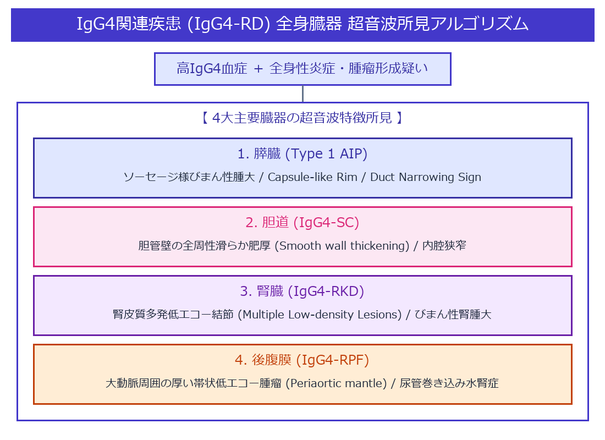

# IgG4関連疾患 (IgG4-related Disease: IgG4-RD) 超詳細診断プロトコル

> [!NOTE] 概要
> IgG4関連疾患 (IgG4-RD) は、高IgG4血症と組織へのIgG4陽性形質細胞浸潤・花ござ状線維化 (Storiform fibrosis) を特徴とし、全身の臓器（膵臓・胆管・唾液腺・腎臓・後腹膜など）に腫瘤形成や肥厚を来す原因不明の全身性炎症性疾患です。超音波検査は本疾患の早期発見およびステロイド治療効果判定において極めて主導的な役割を果たします。

---

## 1. 全身臓器における超音波像・特徴的サイン一覧



> [!IMPORTANT] 全身臓器の要点サイン
> 1. **膵臓 (AIP)**: びまん性ソーセージ様腫大 / Capsule-like Rim
> 2. **胆道 (SC)**: 胆管壁のびまん性均一肥厚 (壁内腔の平滑化)
> 3. **腎臓 (IgG4-RKD)**: 腎皮質多発低エコー結節 / 腎肥大
> 4. **後腹膜 (RPF)**: 腹部大動脈周囲の周縁状低エコー帯 (被膜像)

---

## 2. 臓器別 超音波診断基準・鑑別ポイント

### 1) 自己免疫性膵炎 (AIP: Type 1 Autoimmune Pancreatitis)
- **ソーセージ様腫大 (Sausage-like enlargement)**: 膵全体が平滑にびまん性腫大し、小葉構造が消失して均一低エコー化。
- **Capsule-like Rim (被膜様外輪)**: 膵周囲を取り囲む薄い低エコー帯（線維化・炎症性変化）。
- **Duct Narrowing Sign**: 主膵管が細く滑らかに穿通し、癌のような主膵管の高度拡張・途絶を伴わない。

### 2) IgG4関連硬化性胆管炎 (IgG4-SC: Sclerosing Cholangitis)
- 胆管壁が**全周性に滑らかに肥厚 (Smooth wall thickening)**。
- 胆管がん (CCC) に特有の不正な壁破壊や内腔隆起がなく、壁肥厚が滑らかで連続する。

### 3) IgG4関連腎病変 (IgG4-RKD: Renal Kidney Disease)
- **Multiple Low-density Lesions**: 両側腎皮質に散在する**多発性の境界比較的明瞭な低エコー結節 / 楔状低エコー領域**。
- 腎盂壁肥厚 (Pelvic wall thickening) を伴うことがある。

### 4) IgG4関連後腹膜線維症 (IgG4-RPF) / 血管周囲病変
- 腹部大動脈 (AAA) や腸骨動脈の周囲を取り囲む**厚い帯状の低エコー腫瘤 (Periaortic mantle / Coat-like mass)**。
- 尿管を包埋して狭窄させ、水腎症を引き起こす。

---

## 3. 全身スクリーニング手順

1. **膵臓の観察**: びまん性腫大、被膜様外輪、主膵管径を評価。
2. **胆道系の観察**: 肝内・肝外胆管壁の全周性壁肥厚、内腔滑らかさを確認。
3. **両腎の観察**: 腎皮質内の多発低エコー結節、腎盂壁肥厚の有無。
4. **大動脈・後腹膜の観察**: 腹部大動脈～腸骨動脈周囲の Mantel sign（低エコー被覆）、水腎症の有無。
5. **頭頸部（可能であれば）**: 顎下腺・耳下腺の腫大・不均一低エコー化（ミクリッツ病）を確認。

---

## 4. 鑑別診断

| 疾患 | 超音波での鑑別ポイント |
|---|---|
| **膵浸潤性管がん (PDAC)** | 境界不鮮明な低エコー腫瘤、主膵管の高度拡張および断絶。ステロイドで縮小しない。 |
| **胆管がん (CCC) / PSC** | 壁肥厚が不整で管腔が途絶。PSCでは数珠状拡張（Beaded appearance）。 |
| **腎細胞がん (RCC)** | 孤立性の高/低エコー腫瘤、血流豊富。IgG4-RKDのような多発楔状低エコーとは異なる。 |
| **悪性リンパ腫** | 後腹膜リンパ節の著明な融合腫大。IgG4-RPFのような大動脈周縁への密着被覆とは像が異なる。 |

---

## 5. ステロイド治療効果判定 (Therapeutic Response)

- **反応性**: IgG4-RD はステロイド治療 (Prednisolone) に対する反応性が極めて良好。
- **超音波指標**: 投与後 2〜4 週間で、**膵腫大の消退、Capsule-like Rimの消失、胆管壁肥厚の減軽、腎結節の縮小**がリアルタイムに確認可能。

---

## 6. レポート記載例

```
膵臓：全体に平滑なびまん性腫大（ソーセージ様）を認め、周囲に薄い低エコー帯 (Capsule-like rim) を伴う。主膵管の高度拡張なし。
胆道：総胆管壁の全周性で滑らかな肥厚（厚さ 3.5 mm）あり。
両腎：右腎皮質に 2 ヶ所、左腎皮質に 1 ヶ所の境界明瞭な小低エコー領域あり。水腎症なし。
腹部大動脈：下腎動脈レベルの大動脈周囲に厚さ 5 mm の低エコー帯 (Periaortic mantle) を認める。
全身臓器の所見より、IgG4関連疾患 (IgG4-RD) に極めて矛盾しない。血清IgG4測定および精密検査を推奨する。
```
