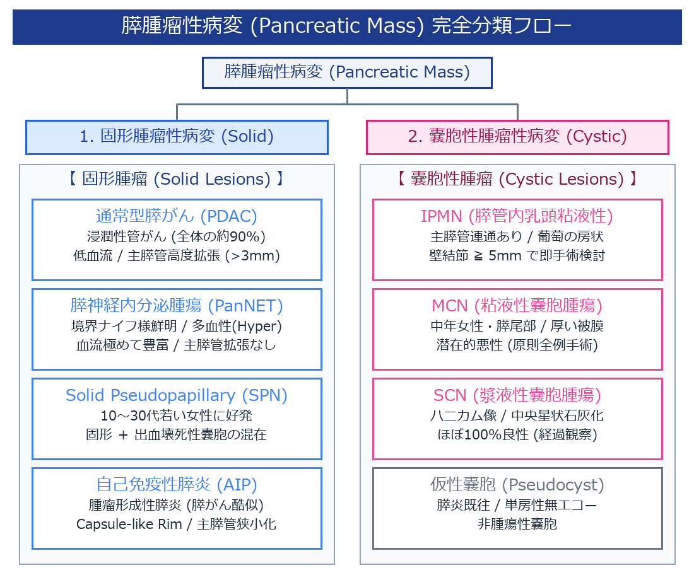

# 膵腫瘤性病変 (Pancreatic Mass Lesions) 完全判定プロトコル

> [!NOTE] 概要
> 膵臓の腫瘤性病変は、日本超音波医学会 (JSUM) および日本膵臓学会の標準分類に基づき、**「固形腫瘤性病変 (Solid Lesions)」** と **「嚢胞性腫瘤性病変 (Cystic Lesions)」** に大別されます。本プロトコルでは、通常型膵がん (PDAC) のみならず、膵神経内分泌腫瘍 (PanNET)、Solid Pseudopapillary Neoplasm (SPN)、自己免疫性膵炎 (AIP) を網羅した完全な鑑別体系を解説します。

---

## 1. 膵腫瘤性病変の完全分類マトリックス

---

## 2. 固形膵腫瘤 (Solid Pancreatic Lesions) の比較鑑別基準

| 疾患名 | Bモード像・輪郭 | 主膵管 (MPD) の変化 | カラードプラ / 造影 (CEUS) 所見 | 好発患者層 |
| :--- | :--- | :--- | :--- | :--- |
| **通常型膵がん (PDAC)** | 境界不鮮明、不整型、**低エコー** | **高度拡張 ( > 3mm )**、途絶 | **低血流 (Hypovascular)**, Kupffer相濃染なし | 高齢男性・女性 |
| **膵神経内分泌腫瘍 (PanNET)** | **境界極めて鮮明**、円形〜楕円形、均一低エコー | 拡張を伴いにくい | **著明な多血性 (Hypervascular)**, 早期濃染 | 中高年 |
| **SPN (Solid Pseudopapillary)** | 境界鮮明、**固形部と壊死性嚢胞の混在像** | 拡張なし | 固形部に血流信号あり | **若年女性 (10～30代)** |
| **自己免疫性膵炎 (AIP)** | 境界比較的明瞭な局所的低エコー / **ソーセージ様腫大** | **主膵管のびまん性狭小化 (Duct Narrowing)** | 早期均一濃染, **Capsule-like Rim (被膜様外輪)** | 高齢男性 |

---

## 3. 臨床上最も重要な「PDAC vs PanNET vs AIP」の完全鑑別ポイント

### 1) 膵神経内分泌腫瘍 (PanNET / 旧インスリノーマ・ガストリノーマ)
- **Bモード特徴**: 腫瘍被膜を有するため**「境界がナイフで切ったように鮮明」**。
- **ドプラ特徴**: 血管性に富むため、カラードプラで結節内部および周囲に**豊富な血流信号**が描出される。主膵管を閉塞させにくいため、主膵管拡張を伴わないことが多い。

### 2) 自己免疫性膵炎 (AIP: Autoimmune Pancreatitis)
- **膵がんとの誤認注意**: 膵頭部などに局所性腫瘤を形成するタイプ（腫瘤形成性膵炎）は、Bモードで低エコー腫瘤に見えるため膵がんと極めて酷似する。
- **決定的な鑑別点**:
  1. **Capsule-like Rim**: 腫瘤周囲を取り囲む薄い**低エコーの被膜様構造**。
  2. **主膵管の狭小化 (Duct Narrowing Sign)**: 膵がんでは主膵管が拡張・途絶するのに対し、AIPでは主膵管が細く滑らかに狭窄する。
  3. **膵全体のソーセージ様（Sausage-like）びまん性腫大**。

---

## 4. 嚢胞性膵腫瘤 (Cystic Pancreatic Lesions) の鑑別基準

1. **IPMN (膵管内乳頭粘液性腫瘍)**: 主膵管との連通あり。葡萄の房状。
2. **MCN (粘液性嚢胞腫瘍)**: 中年女性・膵尾部。連通なし。厚い被膜・卵巣様間質。
3. **SCN (漿液性嚢胞腫瘍)**: 微小嚢胞の集合（ハニカム構造）。中央星状石灰化 (Central Scar)。
4. **仮性嚢胞 (Pseudocyst)**: 膵炎の既往。単房性無エコー。被膜増厚。

---

## 🔗 関連リンク
- [[00_MOC_目次|MOC目次へ戻る]]
- [[03_疾患別超音波所見/膵臓_膵がん|膵がん (PDAC)]]
- [[03_疾患別超音波所見/膵臓_膵嚢胞性腫瘍|膵嚢胞性腫瘍 (IPMN / MCN / SCN)]]
- [[03_疾患別超音波所見/膵臓_急性・慢性膵炎|急性・慢性膵炎]]
