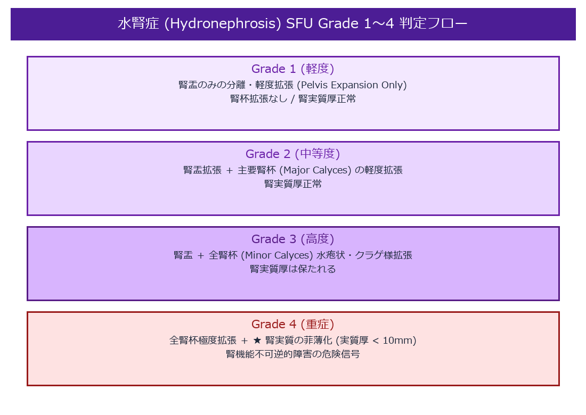

# 水腎症 (Hydronephrosis) 超詳細診断プロトコル

> [!NOTE] 概要
> 水腎症は尿路系の通過障害により腎盂・腎杯が拡張し、無治療では腎実質萎縮・機能全廃を招く状態です。本プロトコルでは **Society for Fetal Urology (SFU) の国際Grade分類** および、カラー・カラードプラを用いた結石検出技法 (Twinkling Artifact) を含め解説します。

---

## 1. SFU / JSUM 水腎症の重症度 Grade 分類



```text
 ┌────────────────────────────────────────────────────────┐
 │ Grade 1: 腎盂のみの軽度分離拡張 (Pelvis Expansion)      │
 │ Grade 2: 腎盂の拡張 ＋ 一部腎杯 (Major Calyces) の拡張  │
 │ Grade 3: 全腎杯の著明な水疱状拡張 (Major & Minor Calyces)│
 │ Grade 4: 全腎杯の著明拡張 ＋ 腎実質の菲薄化 (Thinning)   │
 └────────────────────────────────────────────────────────┘
```

### Grade 4 判定の決定打: 腎実質厚 (Parenchymal Thickness)
- 腎実質厚（腎被膜外縁からCEC外縁までの最短距離）が **< 10.0 mm (1.0 cm)** に薄化した場合、腎機能不可逆的障害の危険信号（Grade 4）と判定される。

---

## 2. 尿路結石同定のための Twinkling Artifact (カラー点滅アーチファクト)

微小な腎結石・尿管結石（< 3mm）はBモードで明確な Acoustic Shadow を伴わない場合があり、カラードプラの活用が威力を発揮します。

- **発生原理**: 結石表面の微細な凹凸・粗雑面において超音波ビームが複雑乱反射し、ドプラ信号の位相偏移がモザイク状に生じる現象。
- **超音波像**: 結石の背後に赤・青のモザイク信号が高速で点滅・描出（Twinkling）。
- **臨床的価値**: **Bモードで音響陰影が出ない 2～3mm の微小尿管結石の発見率を大幅向上**。

---

## 🔗 関連リンク
- [[00_MOC_目次|MOC目次へ戻る]]
- [[02_臓器別解剖と標準描出/腎臓・副腎_解剖と描出法|腎臓・副腎：解剖と描出法]]
- [[03_疾患別超音波所見/血管_ナットクラッカー症候群|ナットクラッカー症候群]]