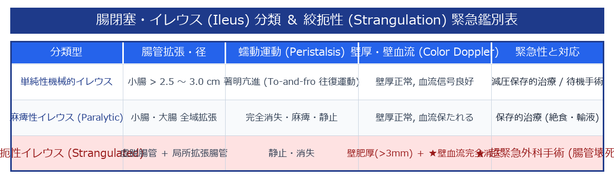

# 腸閉塞・イレウス (Ileus) 超詳細診断プロトコル

> [!NOTE] 概要
> イレウス（腸閉塞）は腸内容物の通過障害を来す疾患であり、特に**絞扼性イレウス (Strangulated Ileus)** は腸管壊死・穿孔・敗血症ショックを来す超緊急疾患です。本プロトコルではBモードによる腸管拡張・Kerckring褶襞（ザーゲ像）およびカラードプラ血流判定による緊急識別法を解説します。

---

## 1. 腸閉塞判定の3大エコーサイン

1. **腸管拡張 (Intestinal Dilation)**:
   - **小腸**: 径 **> 2.5 ～ 3.0 cm** 以上の液体・ガス貯留拡張。
   - **大腸**: 径 **> 5.0 cm** 以上の拡張。
2. **Key-board Sign (ザーゲ像 / 輪状褶襞)**:
   - 拡張した空腸において、Kerckring褶襞（粘膜ひだ）がキーボードの鍵盤や鋸の歯（ザーゲ）のように突き出て並ぶ像。
3. **To-and-fro 運動 (往復運動)**:
   - 閉塞部口側の腸管が強力に収縮・蠕動するが、行き場を失った腸内容物が前後に往復（To-and-fro）運動を呈する。

---

## 2. 閉塞メカニズムの分類と絞扼性 (Strangulation) の緊急鑑別

> [!CAUTION] 絞扼性イレウスの超緊急警告サイン
> 絞扼性では、初期の強い蠕動運動から一転して**腸管の完全静止**を来し、カラードプラにて**「腸管壁内血流信号の完全消失 (無血流)」** を呈する。この所見を認めた場合は、直ちに緊急開腹・腹腔鏡手術へ移行する。

---

## 🔗 関連リンク
- [[00_MOC_目次|MOC目次へ戻る]]
- [[03_疾患別超音波所見/14_消化管_急性虫垂炎|急性虫垂炎]]
- [[03_疾患別超音波所見/20_血管_SMA症候群|上腸間膜動脈症候群 (SMA症候群)]]
