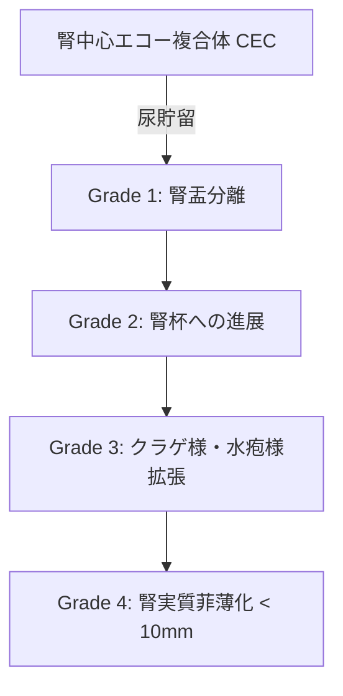

# 水腎症 (Hydronephrosis) 診断プロトコル

> [!NOTE] 概要
> 水腎症は尿路の通過障害（結石、腫瘍、狭窄、外部圧迫）により腎盂・腎杯が尿で拡張した状態です。超音波検査は水腎症の検出およびグレード分類における第一選択です。

---

## 1. 水腎症の重症度グレード分類 (SFU Grade)

腎盂・腎杯の拡張パターンおよび腎実質の薄化度合いに基づき、Grade 1 ～ 4 に分類します。

```text
 Grade 1: 腎盂のみの軽度拡張 (Pelvis Expansion Only)
 Grade 2: 腎盂の拡張 ＋ 主要な腎杯 (Major Calyces) の拡張
 Grade 3: 腎盂・全腎杯の著明な拡張 (Calyces Rounded), 実質厚は保たれる
 Grade 4: 腎盂・全腎杯の極度拡張 ＋ 腎実質の薄化 (Parenchymal Thinning < 10mm)
```



---

## 2. 閉塞部位（原因）の同定ステップ

水腎症を検出した場合、必ず拡張した尿管を下降追跡し、閉塞原因を検索します。

1. **腎盂尿管移行部 (UPJ) 閉塞**: 腎盂のみ著明拡張、尿管は非拡張。
2. **尿管結石 (Ureteral Stone)**: 拡張尿管の途絶部位に高エコー＋Acoustic shadow、Twinkling artifact (カラー点滅)。
3. **膀胱尿管移行部 (UVJ) 閉塞 / 膀胱がん / 前立腺腫大**: 左右両側の水腎症や膀胱内結節。

---

## 🔗 関連リンク
- [[00_MOC_目次|MOC目次へ戻る]]
- [[02_臓器別解剖と標準描出/腎臓・副腎_解剖と描出法|腎臓・副腎：解剖と描出法]]
- [[03_疾患別超音波所見/腎臓_尿路結石|腎・尿路結石]]
- [[03_疾患別超音波所見/腎臓_腎細胞がん|腎細胞がん(RCC)]]
