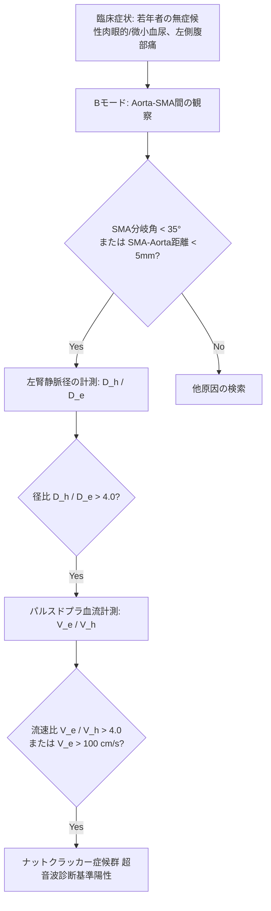

# ナットクラッカー症候群 (Nutcracker Syndrome / Left Renal Vein Entrapment)

> [!NOTE] 概要
> ナットクラッカー現象（Nutcracker phenomenon）は、**左腎静脈 (Left Renal Vein: LRV)** が **腹部大動脈 (Aorta)** と **上マゼンタ系動脈 (Superior Mesenteric Artery: SMA)** の間で夾雑（挟み込み）され、末梢側（左腎側）の左腎静脈圧が上昇して側副血行路形成や血尿、左側腹部痛・骨盤うっ血を来す病態です。

---

## 1. 解剖・解剖学的計測と指標

上腹部正中横断走査および縦断走査にて、AortaとSMAの分岐部を観察します。

```text
       【SMA】
        /  ← SMA分岐角 (SMA Angle)
       /  
  (LRV) ◯ ← 挟み込まれた左腎静脈
     ━━━━━━━
     【Aorta】
```

### 🔑 解剖学的診断基準 (Anatomical Criteria)

1. **SMA分岐角 (SMA Angle)**:
   - 正常: **45° ～ 60°**
   - ナットクラッカー症候群: **< 35°** (狭小化)
2. **SMA-Aorta間距離 (SMA-Aorta Distance)**:
   - 正常: **10 ～ 14 mm**
   - ナットクラッカー症候群: **< 4.0 ～ 5.0 mm**

---

## 2. 超音波像の観察・計測ステップ (US Diagnostic Steps)

### STEP 1: Bモードによる径の計測 (Distance Ratio)
上腹部正中横断像で左腎静脈を追跡し、以下の2箇所で内径を計測します。

- **$D_{h}$ (Hilar diameter)**: 腎門部近くの拡張した左腎静脈径
- **$D_{e}$ (Entrapped/Narrowed diameter)**: SMAとAorta間で最も狭窄している左腎静脈径

> [!IMPORTANT] 径の拡張比基準
> - **$D_{h} / D_{e} > 4.0 ～ 5.0$** (腎門部径が狭窄部径の 4〜5 倍以上に拡張)
> - ※ 仰臥位および立位（または座位）での変化を確認する。

---

### STEP 2: パルスドプラ (PW Doppler) による流速の計測 (Velocity Ratio)
カラードプラで左腎静脈を同定し、サンプリングボリュームを置きます（サンプル幅 1.5～2.0mm）。

- **$V_{e}$ (Peak Velocity at Entrapment)**: SMA-Aorta間狭窄部での最高血流速度 (PSV)
- **$V_{h}$ (Peak Velocity at Renal Hilum)**: 腎門部拡張部での最高血流速度 (PSV)

```text
【パルスドプラ計測値の評価】
  - 狭窄部流速 ($V_{e}$): 著明に上昇 (> 100 cm/s に達することもある)
  - 腎門部流速 ($V_{h}$): 著明に低下 (15～20 cm/s 以下)
```

> [!IMPORTANT] 流速比基準
> - **$V_{e} / V_{h} > 4.0 ～ 5.0$** (狭窄部流速が腎門部流速の 4〜5 倍以上)
> - **狭窄部絶対最高流速 $V_{e} > 100\text{ cm/s}$**

---

### STEP 3: 側副血行路と関連所見の検索
- **左性腺静脈 (Left Gonadal Vein: 卵巣静脈 / 精巣静脈)** の拡張および血流逆流の有無
- **左腎静脈の拍動性** の消失（平坦化）
- **骨盤静脈瘤 (Pelvic Varices)** の観察

---

## 3. 超音波診断フローチャート



---

## 🔗 関連リンク
- [[00_MOC_目次|MOC目次へ戻る]]
- [[02_臓器別解剖と標準描出/腎臓・副腎_解剖と描出法|腎臓・副腎：解剖と描出法]]
- [[02_臓器別解剖と標準描出/腹部血管・後腹膜_解剖と描出法|腹部血管・後腹膜：解剖と描出法]]
- [[04_実践スクリーニング・計測/腹部超音波計測値一覧|腹部超音波計測値一覧]]
